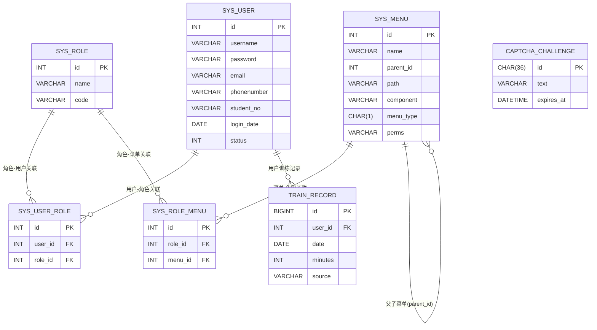

# 项目结构

```tex
╧ε─┐┤·┬δ/
├── DjangoProject/              # 后端 Django 主配置工程
│   ├── __init__.py
│   ├── asgi.py
│   ├── settings.py
│   ├── urls.py
│   └── wsgi.py
│
├── business/                   # 业务相关 Django 应用（核心业务模块）
│   ├── __init__.py
│   ├── apps.py
│   ├── middleware.py
│   ├── migrations/
│   │   ├── 0001_initial.py
│   │   └── __init__.py
│   ├── models.py
│   ├── tests.py
│   ├── urls.py
│   ├── utils.py
│   ├── views_admin.py
│   └── views_my.py
│
├── menu/                       # 菜单/权限相关 Django 应用
│   ├── __init__.py
│   ├── admin.py
│   ├── apps.py
│   ├── migrations/
│   │   └── ...                 # 迁移文件若干
│   ├── models.py
│   ├── tests.py
│   ├── urls.py
│   └── views.py
│
├── role/                       # 角色管理相关 Django 应用
│   ├── __init__.py
│   ├── admin.py
│   ├── apps.py
│   ├── migrations/
│   │   └── ...                 # 迁移文件若干
│   ├── models.py
│   ├── tests.py
│   ├── urls.py
│   └── views.py
│
├── user/                       # 用户管理 & 身份认证 Django 应用
│   ├── __init__.py
│   ├── admin.py
│   ├── apps.py
│   ├── middleware.py
│   ├── migrations/
│   │   ├── 0001_initial.py
│   │   ├── 0002_captchachallenge_sysuser_student_no.py
│   │   └── __init__.py
│   ├── models.py
│   ├── tests.py
│   ├── urls.py
│   └── views.py
│
├── python222_vue3_admin3/      # 前端 Vue 3 管理后台工程
│   ├── .gitignore
│   ├── README.md
│   ├── babel.config.js
│   ├── jsconfig.json
│   ├── package-lock.json
│   ├── package.json
│   ├── vue.config.js
│   ├── public/
│   │   └── ...                 # 公共静态资源
│   └── src/
│       ├── App.vue
│       ├── main.js
│       ├── assets/             # 样式/图片等资源（内容较多省略）
│       ├── components/         # 公共组件
│       ├── icons/              # 图标资源（大量 svg，省略）
│       ├── layout/             # 布局相关组件
│       ├── router/             # 前端路由配置
│       ├── store/              # 状态管理（Vuex/Pinia等）
│       ├── util/               # 工具函数
│       └── views/              # 各业务页面视图
│
├── captcha_font/               # 验证码字体资源
│   └── MonaspaceNeon-WideBold.otf
│
├── media/                      # 媒体文件（如头像）
│   └── userAvatar/
│       └── *.jpg               # 多个头像图片
│
├── rsa_keys/                   # RSA 密钥
│   └── private.pem
│
├── vite/                       # 可能为构建相关目录（当前为空）
│
└── manage.py                   # Django 管理入口

```


# 后端


## DjangoProject文件夹

下面是 **DjangoProject 文件夹下所有文件** 的函数/配置级技术说明（只涵盖 `DjangoProject/__init__.py, asgi.py, settings.py, urls.py, wsgi.py`）。

------

### 文件名: `DjangoProject/__init__.py`

**文件功能概述**:
 标记 `DjangoProject` 为一个 Python 包，供 Django 以 `DjangoProject.xxx` 的形式导入各子模块（settings, urls, wsgi 等）。

**函数/类 详细列表**:

| 函数/方法名 | 输入参数 (Args) | 返回值 (Return) | 核心逻辑与目的 (Description)                                 |
| ----------- | --------------- | --------------- | ------------------------------------------------------------ |
| -           | -               | -               | 本文件为空，仅用于将 `DjangoProject` 目录标记为包，方便通过 `DjangoProject.settings`、`DjangoProject.urls` 等路径导入配置模块。 |

------

### 文件名: `DjangoProject/asgi.py`

**文件功能概述**:
 提供 ASGI 入口，用于在支持 ASGI 的服务器（如 uvicorn、daphne）上运行本 Django 应用。

**函数/类 详细列表**:

| 函数/方法名                                | 输入参数 (Args)                                              | 返回值 (Return)                            | 核心逻辑与目的 (Description)                                 |
| ------------------------------------------ | ------------------------------------------------------------ | ------------------------------------------ | ------------------------------------------------------------ |
| `application`（模块级变量，ASGI callable） | 无显式入参。ASGI 服务器会以 `(scope, receive, send)` 的形式调用此对象。 | ASGI callable（Django 内部生成的应用对象） | **目的**：作为 ASGI 服务器（如 uvicorn）的入口，将外部 HTTP/WebSocket 请求交由 Django 处理。**逻辑**：1）`import os` 和 `from django.core.asgi import get_asgi_application`；2）调用 `os.environ.setdefault('DJANGO_SETTINGS_MODULE', 'DjangoProject.settings')` 设置默认配置模块；3）调用 `get_asgi_application()` 生成 ASGI 应用对象，并赋值给 `application`；4）部署时，服务器会导入 `DjangoProject.asgi:application` 作为入口。 |

> 备注：
>
> - `DJANGO_SETTINGS_MODULE` 指向 `DjangoProject.settings`，与项目实际的 `settings.py` 文件路径吻合，这部分配置是正确的。

------

### 文件名: `DjangoProject/wsgi.py`

**文件功能概述**:
 提供 WSGI 入口，用于在传统 WSGI 服务器（如 gunicorn、uWSGI、mod_wsgi）上运行 Django 应用。

**函数/类 详细列表**:

| 函数/方法名                                | 输入参数 (Args)                                              | 返回值 (Return)                            | 核心逻辑与目的 (Description)                                 |
| ------------------------------------------ | ------------------------------------------------------------ | ------------------------------------------ | ------------------------------------------------------------ |
| `application`（模块级变量，WSGI callable） | 无显式入参。WSGI 服务器以 `(environ, start_response)` 的形式调用。 | WSGI callable（Django 内部生成的应用对象） | **目的**：作为 WSGI 服务器的统一入口，将 HTTP 请求交由 Django 处理。**逻辑**：1）`import os` 和 `from django.core.wsgi import get_wsgi_application`；2）调用 `os.environ.setdefault('DJANGO_SETTINGS_MODULE', 'python222_admin3.settings')` 设置 Django 配置模块；3）通过 `get_wsgi_application()` 获取 WSGI 应用对象并赋给 `application`；4）部署时服务器会导入 `DjangoProject.wsgi:application`。 |

> ⚠ **潜在问题说明**：
>
> - 当前 `wsgi.py` 中 `DJANGO_SETTINGS_MODULE` 被设置为 `'python222_admin3.settings'`，而实际项目中的配置文件是 `DjangoProject/settings.py`。
>
> - 这意味着如果直接使用 `wsgi.py` 部署，将尝试导入 `python222_admin3.settings`，在当前代码结构下可能会报 `ModuleNotFoundError`。
>
> - 建议将第 14 行修改为：
>
>   ```python
>   os.environ.setdefault('DJANGO_SETTINGS_MODULE', 'DjangoProject.settings')
>   ```
>
>   以与 `asgi.py` 和实际项目结构保持一致。

------

### 文件名: `DjangoProject/settings.py`

**文件功能概述**:
 Django 全局配置文件，定义数据库连接、已安装应用、中间件、模板、静态文件、媒体文件、CORS 策略等，控制整个后端服务的运行行为。

> 说明：本文件几乎不定义函数/类，主要由配置常量组成。下面表格按关键配置块进行“函数级”粒度的说明（把“配置块”视为模块内的“逻辑单元”来分析）。

**函数/类 详细列表**:

| 函数/方法名（配置块）                                 | 输入参数 (Args)                        | 返回值 (Return)                                              | 核心逻辑与目的 (Description)                                 |
| ----------------------------------------------------- | -------------------------------------- | ------------------------------------------------------------ | ------------------------------------------------------------ |
| `BASE_DIR`                                            | 无。模块加载时根据当前文件路径计算。   | `Path` 对象，指向项目根目录（`DjangoProject` 的上一层）。    | **目的**：统一管理项目路径，便于构造文件/目录路径，如 `BASE_DIR / 'templates'`、`BASE_DIR / 'media'`。**逻辑**：调用 `Path(__file__).resolve().parent.parent`，即当前文件的父目录的父目录。 |
| `SECRET_KEY`                                          | 无。硬编码在配置中。                   | 字符串密钥。                                                 | **目的**：用于 Django 的签名/加密（session、CSRF token 等）。**逻辑**：在开发环境固定写死；生产环境应改为读取环境变量，避免泄露。 |
| `DEBUG`                                               | 无。配置常量。                         | `True` / `False`                                             | **目的**：控制调试模式；当前值为 `True`，说明默认是开发环境。**逻辑**：当 `True` 时，会显示详细错误页面、允许未在 `ALLOWED_HOSTS` 列表中的主机访问（本地开发）。生产环境应改为 `False`。 |
| `ALLOWED_HOSTS`                                       | 无。列表常量。                         | `list[str]`，当前为空列表 `[]`。                             | **目的**：限制可以访问此 Django 实例的域名/IP。**逻辑**：当前为空表示“仅允许本机/调试环境”；若部署到服务器，需要将实际域名或 IP 填入。 |
| `INSTALLED_APPS`                                      | 无。列表常量。                         | `list[str]` 应用列表。                                       | **目的**：注册 Django 使用的内置应用、第三方应用和项目自定义应用。**逻辑**：本项目中包括：1）Django 内置：`django.contrib.auth`, `contenttypes`, `sessions`, `messages`, `staticfiles` 等；2）第三方：`corsheaders`（跨域）、`rest_framework`（DRF）、`rest_framework_jwt`（JWT 支持）；3）本地应用：`user.apps.UserConfig`、`role.apps.RoleConfig`、`menu.apps.MenuConfig`、`business`。这意味着后端采用 **Django REST Framework + JWT** 作为主要 API & 认证方案，并按模块拆分了用户/角色/菜单/业务四个应用。 |
| `MIDDLEWARE`                                          | 无。列表常量。                         | `list[str]` 中间件链。                                       | **目的**：定义请求/响应经过的中间件顺序，从上到下依次执行。**核心条目**：1）`corsheaders.middleware.CorsMiddleware` —— 最靠前，负责处理跨域请求头；2）`django.middleware.security.SecurityMiddleware`、`SessionMiddleware`、`CommonMiddleware` —— 标准安全与 session 支持；3）`django.contrib.auth.middleware.AuthenticationMiddleware`、`MessageMiddleware`、`XFrameOptionsMiddleware` —— 认证、消息和 X-Frame 安全；4）`user.middleware.JwtAuthenticationMiddleware` —— 自定义 JWT 认证中间件，实现基于 Token 的认证逻辑（具体逻辑在 `user/middleware.py`）。**逻辑**：请求到达时依次通过这些中间件，执行 CORS 校验、加载 session、做 JWT 校验等，再进入对应 view。 |
| `CORS_ORIGIN_ALLOW_ALL` / `CORS_ALLOW_CREDENTIALS`    | 无。配置常量。                         | 布尔值 True / False。                                        | **目的**：控制跨域访问策略。**逻辑**：`CORS_ORIGIN_ALLOW_ALL = True` 表示允许任何源发起跨域请求；`CORS_ALLOW_CREDENTIALS = True` 允许携带 cookie/认证信息。两者结合意味着后端对所有域开放，但仍可以通过 JWT 中间件控制业务权限。 |
| `CORS_ALLOW_HEADERS` / `CORS_ALLOW_METHODS`           | 无。使用 `corsheaders.defaults` 计算。 | `list[str]`。                                                | **目的**：细化允许的跨域请求头和方法。**逻辑**：- `CORS_ALLOW_HEADERS = list(default_headers) + ['authorization']`：在默认允许的头基础上新增 `Authorization`，保证前端通过 Authorization 头传 JWT 时不会被 CORS 拦截。- `CORS_ALLOW_METHODS = list(default_methods)`：包含 `OPTIONS`, `GET`, `POST`, `PUT`, `PATCH`, `DELETE` 等常见方法。 |
| `ROOT_URLCONF`                                        | 无。字符串常量。                       | `'DjangoProject.urls'`                                       | **目的**：指定全局 URL 路由配置模块。**逻辑**：Django 在启动时从此模块中加载 `urlpatterns`，路由分发由 `DjangoProject/urls.py` 控制。 |
| `TEMPLATES`                                           | 无。列表+字典配置。                    | 列表，内部为模板引擎配置字典。                               | **目的**：配置 Django 模板系统（HTML 渲染）。**逻辑**：1）使用 `django.template.backends.django.DjangoTemplates` 后端；2）`DIRS: [BASE_DIR / 'templates']`：项目根下 `templates` 目录作为模板搜索路径；3）`APP_DIRS: True`：启用各 app 下的 `templates` 目录；4）`context_processors` 包含 `debug`, `request`, `auth`, `messages` 等标准上下文处理器。 |
| `WSGI_APPLICATION`                                    | 无。字符串常量。                       | `'DjangoProject.wsgi.application'`                           | **目的**：指定 WSGI 入口对象路径。**逻辑**：WSGI 服务器会导入该路径寻找 `application` 对象，与 `wsgi.py` 中的变量相对应。当前 settings 中是正确的（指向 `DjangoProject.wsgi.application`），但 `wsgi.py` 自身却引用了错误的 `DJANGO_SETTINGS_MODULE`，需要统一。 |
| `DATABASES`                                           | 无。字典配置。                         | `dict`，包含默认数据库连接配置。                             | **目的**：配置系统的数据库连接信息。**逻辑**：- 使用 MySQL：`ENGINE = 'django.db.backends.mysql'`；- 数据库名：`db_admin2`；- 用户名：`root`，密码 `1234`（示例）；- 主机：`localhost`，端口：`3306`。这说明项目采用 MySQL 做持久化存储，具体表结构由各 app 的 `models.py` 和 migrations 决定。 |
| `AUTH_PASSWORD_VALIDATORS`                            | 无。列表配置。                         | `list[dict]`，每个 dict 定义一个验证器。                     | **目的**：配置用户密码策略。**逻辑**：使用 Django 默认的四个验证器：1）`UserAttributeSimilarityValidator` —— 避免密码与用户名/邮箱等太相似；2）`MinimumLengthValidator` —— 限制最小长度；3）`CommonPasswordValidator` —— 拒绝常见弱密码；4）`NumericPasswordValidator` —— 限制纯数字密码。 |
| `LANGUAGE_CODE` / `TIME_ZONE` / `USE_I18N` / `USE_TZ` | 无。常量配置。                         | 各种基础类型。                                               | **目的**：控制国际化和时区。**逻辑**：`LANGUAGE_CODE = 'en-us'`，`TIME_ZONE = 'UTC'`，`USE_I18N = True`，`USE_TZ = True`。表示默认使用英文和 UTC 时区，时间会以感知时区的方式存储。 |
| `STATIC_URL`                                          | 无。字符串。                           | `'static/'`                                                  | **目的**：配置静态文件的 URL 前缀。**逻辑**：当前仅设置 URL，没有设置 `STATIC_ROOT`；通常在生产环境会额外指定收集静态文件的物理目录。 |
| `MEDIA_ROOT` / `MEDIA_URL`                            | 无。常量。                             | `MEDIA_ROOT` 为 `BASE_DIR / 'media'`，`MEDIA_URL` 为 `'media/'`。 | **目的**：配置媒体文件（上传文件）的物理存储路径和访问 URL。**逻辑**：上传的文件会保存到 `项目根/media` 目录，通过 `MEDIA_URL`（在 `DjangoProject/urls.py` 中通过 `re_path` 映射）对外暴露访问路径。 |

------

### 文件名: `DjangoProject/urls.py`

**文件功能概述**:
 整个后端项目的**根 URL 路由配置**。将不同的 URL 前缀（`/user/`, `/role/`, `/menu/`, `/bsns/` 等）分发到对应 app 的 `urls.py`，并配置媒体文件访问路由。

**函数/类 详细列表**:

> 本文件主要定义一个模块级路由列表 `urlpatterns`，不包含普通函数/类。我们把 `urlpatterns` 视作一个“核心逻辑单元”进行说明。

| 函数/方法名（逻辑单元） | 输入参数 (Args)                              | 返回值 (Return)                          | 核心逻辑与目的 (Description)                                 |
| ----------------------- | -------------------------------------------- | ---------------------------------------- | ------------------------------------------------------------ |
| `urlpatterns`（路由表） | 由 Django 路由系统使用，不由开发者直接传参。 | `list[URLPattern]` / `list[URLResolver]` | **目的**：定义项目的 URL 路由与子应用分发规则。**逻辑**：1）导入： - `from django.contrib import admin`（当前 admin 路由注释掉）； - `from django.urls import path, include, re_path`； - `from django.views.static import serve`（用于媒体文件）； - `from DjangoProject import settings`（读取 `MEDIA_ROOT`）。2）核心路由项： - `path('user/', include('user.urls'))` —— 把所有 `/user/` 开头的请求交给 `user/urls.py` 处理（用户模块：登录、注册、用户管理等）； - `path('role/', include('role.urls'))` —— 把 `/role/` 路径交给 `role/urls.py` 处理（角色管理）； - `path('menu/', include('menu.urls'))` —— 把 `/menu/` 路径交给 `menu/urls.py` 处理（菜单/权限管理）； - `path('bsns/', include('business.urls'))` —— 把 `/bsns/` 路径交给 `business/urls.py` 处理（业务模块）；3）媒体文件路由： - `re_path('media/(?P<path>.*)', serve, {'document_root': settings.MEDIA_ROOT}, name='media')` —— 使用 `django.views.static.serve` 将 `/media/...` 请求映射到物理目录 `MEDIA_ROOT`，便于访问上传文件（如头像）。4）可选 admin：`path('admin/', admin.site.urls)` 当前被注释掉，如需启用后台管理需要解除注释。 |


## User

### 文件名: `[user/__init__.py]`

**文件功能概述**:
 将 `user` 目录标记为一个 Python 包，方便被 Django 通过 `user.xxx` 的形式导入。

**函数/类 详细列表**:

| 函数/方法名 | 输入参数 (Args) | 返回值 (Return) | 核心逻辑与目的 (Description)                                 |
| ----------- | --------------- | --------------- | ------------------------------------------------------------ |
| `（无）`    | 无              | 无              | **目的**: 本文件为空，仅用于声明包。**逻辑**: 不包含任何类、函数或变量定义。 |

------

### 文件名: `[user/apps.py]`

**文件功能概述**:
 声明 `user` 应用的 Django App 配置，用于在 `INSTALLED_APPS` 中注册。

**函数/类 详细列表**:

| 函数/方法名                            | 输入参数 (Args)                    | 返回值 (Return)   | 核心逻辑与目的 (Description)                                 |
| -------------------------------------- | ---------------------------------- | ----------------- | ------------------------------------------------------------ |
| `UserConfig` (`django.apps.AppConfig`) | 无显式入参（由 Django 自动实例化） | `UserConfig` 实例 | **目的**: 告诉 Django 本应用的名称及默认主键类型。**逻辑**: 1. `default_auto_field = 'django.db.models.BigAutoField'`，使模型默认使用 64 位自增主键；2. `name = 'user'` 指定 app 标签名，在 `INSTALLED_APPS` 中通过 `'user.apps.UserConfig'` 注册。 |

------

### 文件名: `[user/models.py]`

**文件功能概述**:
 定义用户相关的数据模型、序列化器，以及验证码挑战模型，用于登录验证码验证。

**函数/类 详细列表**:

| 函数/方法名                                         | 输入参数 (Args)                                      | 返回值 (Return)                          | 核心逻辑与目的 (Description)                                 |
| --------------------------------------------------- | ---------------------------------------------------- | ---------------------------------------- | ------------------------------------------------------------ |
| `SysUser` (`models.Model`)                          | 无显式方法参数（Django ORM 使用关键字参数创建/查询） | Django ORM 模型实例，对应表 `sys_user`   | **目的**: 存储系统用户账号信息。**逻辑（主要字段）**: 1. `id`: `AutoField(primary_key=True)`，主键；2. `username`: `CharField(max_length=100, unique=True)`，登录名，唯一；3. `password`: `CharField(max_length=100)`，用户密码（当前为明文存储，需注意安全）；4. `avatar`: 用户头像文件名；5. `email`: 用户邮箱；6. `phonenumber`: 手机号；7. `student_no`: 学号/工号（可空但唯一），用于与成员系统绑定；8. `login_date`: 最后登录日期；9. `status`: 账号状态（0 正常，1 停用）；10. `create_time` / `update_time`: 创建/更新时间；11. `remark`: 备注；12. `class Meta: db_table = "sys_user"` 显式指定表名。 |
| `SysUserSerializer` (`serializers.ModelSerializer`) | 标准 DRF `ModelSerializer` 入参（实例或 QuerySet）   | `dict` / `list[dict]`                    | **目的**: 将 `SysUser` 模型对象序列化为 JSON 友好的字典，用于 API 返回。**逻辑**: 在 `Meta` 内指定 `model = SysUser`、`fields = '__all__'`，序列化用户的全部字段。 |
| `CaptchaChallenge` (`models.Model`)                 | 无显式方法参数（ORM 使用）                           | 模型实例，对应表 `user_captchachallenge` | **目的**: 用于验证码挑战：存储一次验证码文本及过期时间。**逻辑（字段）**：1. `id`: `UUIDField(primary_key=True, default=uuid.uuid4, editable=False)`，前端登录时会携带该 ID；2. `text`: `CharField(max_length=10)`，验证码正确文本（大写字母）；3. `expires_at`: `DateTimeField`，过期时间（登录接口根据此字段判断是否过期）。 |
| `CaptchaChallenge.create_new` (`@classmethod`)      | `cls`: 类型本身                                      | `CaptchaChallenge` 实例                  | **目的**: 生成一条新的验证码挑战记录，配合后端 GIF 验证码使用。**逻辑**: 1. 定义字符集 `ALLOWED_CHARS = "ABCDEFGHJKLMNPRSTXYZ"`（去掉 I/O/Q 等易混字符）；2. 设定验证码长度 `CAPTCHA_LENGTH = 5`；3. 使用 `random.choices` 随机生成 5 位大写字母字符串 `text`；4. `expires_at = timezone.now() + timedelta(minutes=5)` 生成 5 分钟后到期时间；5. 调用 `cls.objects.create(text=text, expires_at=expires_at)` 写入数据库；6. 返回创建好的对象，用于返回给前端。 |

------

### 文件名: `[user/middleware.py]`

**文件功能概述**:
 定义全局 JWT 认证中间件，在非白名单接口上统一校验前端携带的 Token，并在通过时把用户 ID 注入 `request.jwt_user_id`。

**函数/类 详细列表**:

| 函数/方法名                                       | 输入参数 (Args)                                      | 返回值 (Return)          | 核心逻辑与目的 (Description)                                 |
| ------------------------------------------------- | ---------------------------------------------------- | ------------------------ | ------------------------------------------------------------ |
| `JwtAuthenticationMiddleware` (`MiddlewareMixin`) | `get_response`: 标准 Django 中间件入参（由父类处理） | 中间件实例               | **目的**: 作为 Django 的自定义中间件挂在 `MIDDLEWARE` 中，统一处理请求前的 JWT 校验。**逻辑**: 继承 `django.utils.deprecation.MiddlewareMixin`，实现 `process_request` 钩子；被配置在 `settings.MIDDLEWARE` 的末尾。 |
| `JwtAuthenticationMiddleware.process_request`     | `self``request`: `HttpRequest`                       | `HttpResponse` 或 `None` | **目的**: 在视图执行前，从请求头中抽取 JWT Token，校验并解析出用户 ID。**逻辑**: 1. 定义白名单列表，如 `/user/login`, `/user/register`, `/media/userAvatar`, `/user/captcha/init` 等，白名单路径（前缀匹配）直接放行；2. 对非白名单请求，如果 `request.method == 'OPTIONS'`（CORS 预检），直接放行；3. 其它请求中，从 `request.META['HTTP_AUTHORIZATION']`、`request.headers['Authorization']`、`request.headers['authorization']` 中依次获取 Token 字符串；4. 如果未携带 Token，则返回 `HttpResponse('未携带Token，请重新登录！', status=401)`；5. 使用 `rest_framework_jwt.settings.api_settings.JWT_DECODE_HANDLER` 解码 Token；6. 从解码后的 `payload` 中尝试获取 `user_id`/`id`/`userId` 任一字段作为用户 ID，并将其写入 `request.jwt_user_id` 提供给后续视图使用；7. 捕获 `ExpiredSignatureError` 返回 “Token过期”；捕获 `InvalidTokenError` 返回 “Token验证失败”；捕获通用 `PyJWTError` 返回 “Token验证异常”；8. 若全部正常则返回 `None`，后续视图继续执行。 |

------

### 文件名: `[user/views.py]`

**文件功能概述**:
 实现用户相关的所有 HTTP 接口（登录、注册、查询、修改、角色授权、密码操作、头像上传等）以及验证码 GIF 生成逻辑。

> 本文件较大，包含：
>
> - 验证码 GIF 生成相关常量与工具函数；
> - 若干基于 `View` 的类视图；
> - 清理过期验证码的工具函数。

#### 1. 验证码 GIF 相关常量与工具函数

**函数/类 详细列表（工具部分）**:

| 函数/方法名                                                  | 输入参数 (Args)                                              | 返回值 (Return)                                         | 核心逻辑与目的 (Description)                                 |
| ------------------------------------------------------------ | ------------------------------------------------------------ | ------------------------------------------------------- | ------------------------------------------------------------ |
| `WIDTH / HEIGHT / CHANNELS / LOOP_FRAMES / SCROLL_SPEED / FONT_SIZE / FONT_PATH` | 无（模块级常量）                                             | 多个常量（int / str）                                   | **目的**: 统一控制验证码 GIF 的尺寸、帧数、滚动速度和字体。**逻辑**: 1. `WIDTH=600`, `HEIGHT=240`, `CHANNELS=3` 表示 RGB 图像尺寸；2. `LOOP_FRAMES=30`，一共 30 帧；3. `SCROLL_SPEED=2` 控制噪声纹理在 y 方向平移速度；4. `FONT_SIZE=150` 设置验证码文字字体大小；5. `FONT_PATH = os.path.join(settings.BASE_DIR, 'captcha_font', 'MonaspaceNeon-WideBold.otf')` 指定字体文件路径。 |
| `_create_text_mask(text, font_size, offset)`                 | `text`: str（验证码文本）`font_size`: int（字体大小）`offset`: tuple(int,int) 文本起始偏移 | `np.ndarray` (bool mask, shape = (HEIGHT, WIDTH))       | **目的**: 将验证码文字绘制到灰度图上并转为布尔掩模，用于在噪声图中区分“文字区域”和“背景区域”。**逻辑**: 1. 使用 `numpy` 创建全 False 的布尔矩阵 `mask`；2. 使用 `ImageFont.truetype(FONT_PATH, font_size)` 加载自定义字体，如失败则回退到默认字体；3. 用 `PIL.Image.new('L', (WIDTH, HEIGHT))` 创建灰度图，并用 `ImageDraw.Draw(img).text(offset, text, font=font, fill=255)` 把文字画上去；4. 将图转为 `numpy` 数组，取灰度值大于 128 的像素作为 True，赋值到 `mask` 中；5. 返回该布尔 mask。 |
| `_generate_looping_noise(width, height, channels)`           | `width`: int`height`: int`channels`: int                     | `np.ndarray` (uint8, shape = (height, width, channels)) | **目的**: 生成一块可平滑循环滚动的黑白噪声纹理，作为动画的背景与文字填充。**逻辑**: 1. 使用 `np.random.choice([0,255], size=(height,width), p=[0.5,0.5])` 生成黑白随机噪声；2. 使用 `np.stack([noise] * channels, axis=-1)` 把单通道复制到 RGB 三通道；3. 返回噪声图。 |
| `_generate_frame(frame_index, text_mask, noise_texture)`     | `frame_index`: int 当前帧号`text_mask`: bool 数组，文字位置`noise_texture`: 噪声纹理数组 | `np.ndarray` (uint8, 单帧 RGB 图像)                     | **目的**: 根据当前帧编号，生成一帧验证码图像，实现“文字一个方向滚动、背景反方向滚动”的视觉效果。**逻辑**: 1. 创建零矩阵 `frame` 作为当前帧；2. 计算 y 坐标数组 `y_coords` 和 x 坐标数组 `x_coords`；3. 计算文字区域偏移 `text_offset = frame_index * SCROLL_SPEED`，背景偏移 `bg_offset = -frame_index * SCROLL_SPEED`；4. 通过取模操作，在 `noise_texture` 上按不同偏移采样 `text_pixels` 和 `bg_pixels`；5. 对 `text_mask` 为 True 的位置使用 `text_pixels`，其余位置用 `bg_pixels`；6. 返回构造好的帧数组。 |
| `generate_captcha_gif(text)`                                 | `text`: str 验证码文字                                       | `bytes`（GIF 二进制）                                   | **目的**: 生成一段循环播放的验证码 GIF，用于前端展示滑动/流动 CAPTCHA。**逻辑**: 1. 调用 `_create_text_mask(text, FONT_SIZE, (10, 44))` 创建文字 mask；2. 计算噪声高度 `noise_height = LOOP_FRAMES * SCROLL_SPEED` 并调用 `_generate_looping_noise` 生成噪声纹理；3. 通过列表推导生成 `LOOP_FRAMES` 帧，帧由 `_generate_frame(i, text_mask, noise_texture)` + `Image.fromarray` 得到；4. 通过 `PIL.Image.save` 将多帧保存为 GIF（`save_all=True`, `append_images=frames[1:]`, `duration=40ms`, `loop=0` 无限循环）；5. 将 GIF 写入 `io.BytesIO` 并返回 `gif_bytes.getvalue()`。 |
| `cleanup_expired_captcha()`                                  | 无                                                           | `None`                                                  | **目的**: 定时/按需清理数据库中已过期的验证码挑战记录。**逻辑**: 调用 `CaptchaChallenge.objects.filter(expires_at__lt=timezone.now()).delete()` 删除所有过期记录，避免表无限膨胀。 |

------

#### 2. 登录 / 权限 / 用户管理视图

**函数/类 详细列表（视图部分）**:

| 函数/方法名                      | 输入参数 (Args)                                              | 返回值 (Return)                               | 核心逻辑与目的 (Description)                                 |
| -------------------------------- | ------------------------------------------------------------ | --------------------------------------------- | ------------------------------------------------------------ |
| `LoginView.buildTreeMenu`        | `self``sysMenuList`: `list[SysMenu]` 平铺菜单列表            | `list[SysMenu]`（带 children 属性的树形列表） | **目的**: 根据菜单的 `parent_id` 字段，将平铺的菜单列表组织为树形结构，供前端侧边栏渲染。**逻辑**: 1. 双重循环遍历 `sysMenuList`，为每个菜单查找其子菜单 `e.parent_id == menu.id`；2. 如 `menu` 尚无 `children` 属性则先创建空列表，然后追加子菜单；3. `parent_id == 0` 的菜单视为根节点，加入 `resultMenuList`；4. 返回构造好的树形菜单列表。 |
| `LoginView.load_rsa_private_key` | `self`                                                       | `Crypto.PublicKey.RSA.RsaKey`                 | **目的**: 从后端私钥文件加载 RSA 私钥，用于解密前端加密的密码。**逻辑**: 1. 通过 `os.path.join(settings.BASE_DIR, "rsa_keys", "private.pem")` 构造私钥路径；2. 以二进制方式读取文件；3. 调用 `RSA.import_key(f.read())` 转为 RSA key 对象并返回。 |
| `LoginView.rsa_decrypt`          | `self``enc_text`: str（Base64 编码后的密文）                 | `str`（解密后的明文密码）                     | **目的**: 用与前端 jsencrypt 相同的 `PKCS1_v1_5` 模式对密码进行解密。**逻辑**: 1. 调用 `load_rsa_private_key` 得到私钥；2. 使用 `PKCS1_v1_5.new(private_key)` 创建解密 cipher；3. 使用 `b64decode` 将前端提交的 Base64 字符串解码为字节；4. 构造 `sentinel = Random.new().read(15)` 作为解密失败的哨兵；5. 调用 `cipher.decrypt(enc_bytes, sentinel)` 得到明文字节并 `.decode("utf-8")` 返回；6. 解密出错时由调用方捕获。 |
| `LoginView.post`                 | `self``request`: `HttpRequest`（body 为 JSON）               | `JsonResponse`                                | **目的**: 处理登录流程：包括验证码验证、密码解密、账号密码校验、生成 JWT、加载角色与菜单。**逻辑**: 1. 尝试解析 `request.body` 为 JSON，失败则返回 `{'code':500, 'info':'请求体不是合法JSON'}`；2. 从 JSON 获取 `username`、`password`（加密字符串）、`challenge_id`、`captcha_answer`；3. 校验验证码参数是否存在，不存在则返回“验证码缺失”；4. 从数据库中按 `challenge_id` 获取 `CaptchaChallenge`，不存在则返回“验证码无效或已过期”；5. 检查 `expires_at` 是否早于当前时间，如过期则删除记录并返回“验证码已过期”；6. 获取正确验证码文本 `challenge_obj.text`，并删除挑战记录；7. 将前端回答 `captcha_answer` 转大写去空格，与真实文本比较，不一致返回“验证码错误”；8. 调用 `rsa_decrypt` 解密密码，失败则返回“密码解密失败”；9. 使用 `SysUser.objects.get(username=username, password=password)` 校验账号密码，失败抛出异常并返回“用户名或者密码错误”；10. 使用 `api_settings.JWT_PAYLOAD_HANDLER` 和 `JWT_ENCODE_HANDLER` 为该用户构造 JWT `token`；11. 通过原生 SQL 查询该用户的角色列表 `SysRole`，拼接角色名字符串 `roles`；12. 对每个角色再次用原生 SQL 查询其菜单列表 `SysMenu`，使用 `set` 去重后整理成列表，排序并调用 `buildTreeMenu` 构建菜单树；13. 使用 `SysMenuSerializer` 序列化菜单树为 JSON 列表；14. 成功时返回 `{'code':200, 'token':token, 'user':SysUserSerializer(user).data, 'info':'登录成功', 'roles':roles, 'menuList':serializerMenuList}`。 |
| `TestView.get`                   | `self``request`: `HttpRequest`                               | `JsonResponse`                                | **目的**: 简单测试接口，验证 Token 携带与用户列表查询。**逻辑**: 1. 从 `request.META['HTTP_AUTHORIZATION']` 获取 Token；2. 如果 Token 非空，则查询所有 `SysUser.objects.all()`，使用 `.values()` 转为字典再 `list()` 转为列表；3. 返回 `{'code':200, 'info':'测试！', 'data':userList}`；4. 若未携带 Token 则返回 `{'code':401, 'info':'没有访问权限！'}`。 |
| `JwtTestView.get`                | `self``request`                                              | `JsonResponse`                                | **目的**: JWT 生成测试接口，用于调试 JWT 配置是否正常。**逻辑**: 1. 通过固定账号 `username='python222', password='123456'` 获取 `SysUser`；2. 用 `api_settings.JWT_PAYLOAD_HANDLER` 构建 payload；3. 用 `JWT_ENCODE_HANDLER` 生成 token 字符串；4. 返回 `{'code':200, 'token':token}`。 |
| `SaveView.post`                  | `self``request`（JSON）                                      | `JsonResponse`                                | **目的**: 新增或修改用户信息。**逻辑**: 1. 解析请求 JSON 到 `data`；2. 当 `data['id'] == -1` 时执行“新增”：使用 `SysUser(...)` 创建对象，设置用户名、邮箱、手机号、状态、备注等；手动设置 `create_time = datetime.now().date()`、`avatar = 'default.jpg'`、并将 `password` 强制设置为 `"123456"`；保存；3. 否则视为“修改”：根据前端传入的各字段构建 `SysUser` 对象（包括 avatar/login_date/status/create_time/update_time），更新 `update_time = datetime.now().date()` 后保存，覆盖原记录；4. 返回 `{'code':200}`。 |
| `ActionView.get`                 | `self``request`（query: `id`）                               | `JsonResponse`                                | **目的**: 根据用户 ID 获取单个用户详情。**逻辑**: 1. 从 `request.GET['id']` 读出 ID；2. 使用 `SysUser.objects.get(id=id)` 获取用户对象；3. 用 `SysUserSerializer` 序列化；4. 返回 `{'code':200, 'user': serialized_user}`。 |
| `ActionView.delete`              | `self``request`（body 为 id 列表）                           | `JsonResponse`                                | **目的**: 批量删除用户及其角色绑定关系。**逻辑**: 1. 将 `request.body` 解析为 `idList`；2. 调用 `SysUserRole.objects.filter(user_id__in=idList).delete()` 删除用户-角色关联；3. 调用 `SysUser.objects.filter(id__in=idList).delete()` 删除用户记录；4. 返回 `{'code':200}`。 |
| `CheckView.post`                 | `self``request`（JSON: `username`）                          | `JsonResponse`                                | **目的**: 校验用户名是否重复。**逻辑**: 1. 解析请求 JSON，获取 `username`；2. 判断 `SysUser.objects.filter(username=username).exists()`；3. 若存在则返回 `{'code':500}` 表示重复；4. 否则返回 `{'code':200}`。 |
| `PwdView.post`                   | `self``request`（JSON: `id`, `oldPassword`, `newPassword`）  | `JsonResponse`                                | **目的**: 修改指定用户的密码（当前为明文比对，不安全，代码中已有注释提醒后续前端加密）。**逻辑**: 1. 解析 JSON 获取用户 ID 和原密码、新密码；2. 查询 `SysUser`；3. 若原密码与数据库中的 `password` 相等，则将密码更新为新密码，并更新 `update_time`，保存；4. 返回 `{'code':200}`；5. 若原密码不匹配，则返回 `{'code':500, 'errorInfo':'原密码错误！'}`。 |
| `ImageView.post`                 | `self``request`（表单文件字段 `avatar`）                     | `JsonResponse`                                | **目的**: 上传用户头像文件到后端 `media/userAvatar/` 目录。**逻辑**: 1. 从 `request.FILES.get('avatar')` 获取上传文件对象；2. 取原始文件名后缀（扩展名），以当前时间 `YYYYMMDDHHMMSS` 生成新文件名；3. 通过 `str(settings.MEDIA_ROOT) + "\\userAvatar\\" + new_file_name` 组织保存路径（注意：使用 Windows 风格 `\\` 路径分隔）；4. 以二进制写入文件内容（按 `chunk` 流式写入）；5. 写入成功返回 `{'code':200, 'title': new_file_name}`，失败捕获异常并返回 `{'code':500, 'errorInfo':'上传头像失败'}`。 |
| `AvatarView.post`                | `self``request`（JSON: `id`, `avatar`）                      | `JsonResponse`                                | **目的**: 更新用户头像字段为新上传的文件名。**逻辑**: 1. 从 JSON 解析出用户 ID 和头像文件名；2. 获取对应 `SysUser` 对象；3. 设置 `avatar = avatar` 并保存；4. 返回 `{'code':200}`。 |
| `SearchView.post`                | `self``request`（JSON: `pageNum`, `pageSize`, `query`）      | `JsonResponse`                                | **目的**: 分页查询用户列表，并附带每个用户的角色列表。**逻辑**: 1. 从 JSON 中取分页参数及模糊查询关键字 `query`；2. 调用 `SysUser.objects.filter(username__icontains=query)` 做用户名模糊查询，再用 `Paginator(..., pageSize).page(pageNum)` 分页；3. 将 `userListPage.object_list.values()` 转为字典列表；4. 对每个用户字典，根据 `user['id']` 通过原生 SQL 关联 `sys_role` 和 `sys_user_role` 查询该用户的角色列表；5. 将角色封装为 `roleListDict` 并挂到 `user['roleList']`；6. 使用 `SysUser.objects.count()` 统计总用户数（注意：这里 total 为全量数量，未按 query 过滤）；7. 返回 `{'code':200, 'userList': users, 'total': total}`。 |
| `PasswordView.get`               | `self``request`（query: `id`）                               | `JsonResponse`                                | **目的**: 将指定用户密码重置为默认值 `"123456"`。**逻辑**: 1. 从 `request.GET['id']` 获取用户 ID；2. 获取对应用户对象；3. 重置 `password = "123456"`，`update_time = datetime.now().date()`；4. 保存并返回 `{'code':200}`。 |
| `StatusView.post`                | `self``request`（JSON: `id`, `status`）                      | `JsonResponse`                                | **目的**: 修改用户状态（启用/停用）。**逻辑**: 1. 解析 JSON 获取 `id` 和 `status`；2. 查询对应 `SysUser`；3. 设置 `status` 字段并保存；4. 返回 `{'code':200}`。 |
| `GrantRole.post`                 | `self``request`（JSON: `id`, `roleIds` 列表）                | `JsonResponse`                                | **目的**: 为用户分配角色（覆盖式授权）。**逻辑**: 1. 解析 JSON，得到用户 ID 与角色 ID 列表；2. 删除该用户在 `SysUserRole` 中的所有旧关联；3. 遍历 `roleIds`，为每个角色 ID 创建一条新的 `SysUserRole(user_id=user_id, role_id=roleId)` 并保存；4. 返回 `{'code':200}`。 |
| `RegisterView.post`              | `self``request`（JSON: `username`, `password`, `email`, `phonenumber`, `student_no`, `role_id`, `member_id`） | `JsonResponse`                                | **目的**: 注册用户 + 分配角色 + 绑定学号/工号。**逻辑**: 1. 解析请求 JSON；2. 校验用户名是否已存在：`SysUser.objects.filter(username=username).exists()`，存在则返回 `{"code":400,"msg":"用户名已存在"}`；3. 若 `student_no` 非空，则校验其唯一性，重复则返回 `{"code":400,"msg":"学号/工号已存在"}`；4. 创建 `SysUser` 对象（用户名、密码、邮箱、手机号、学号、`status=1`、`create_time=今日`、`remark="正式队员"`），保存；5. 关于 `member_id` 的绑定在注释中说明“好像不需要单独映射”；6. 若传入 `role_id`（逻辑上应使用该值，但代码中实际写死为 `role_id=20250001`），则创建一条 `SysUserRole` 关联记录，把用户设置为“正式队员”；7. 否则尝试通过 `SysRole.objects.fliter(name="正式队员").first` 查找默认角色（注意：`fliter` 为拼写错误，应为 `filter`），若存在则为用户创建关联；8. 成功返回 `{"code":200,"msg":"注册成功","user_id":user.id}`；9. 捕获整个过程的异常，打印日志并返回 `{"code":500,"msg":f"注册失败:{str(e)}"}`。 |
| `CaptchaInitView.get`            | `self``request`                                              | `JsonResponse`                                | **目的**: 初始化一次验证码挑战，为登录验证码提供 challenge_id 和 GIF。**逻辑**: 1. 调用 `cleanup_expired_captcha()` 清理已有过期记录；2. 调用 `CaptchaChallenge.create_new()` 生成新验证码挑战对象（包含随机 text 和 5 分钟过期时间）；3. 调用 `generate_captcha_gif(challenge.text)` 生成对应的 GIF 字节流，并 Base64 编码为字符串；4. 返回 `{'code':200, 'challenge_id': str(challenge.id), 'img': 'data:image/gif;base64,'+b64, 'expire_sec':300}`，供前端在登录页展示。 |

------

### 文件名: `[user/urls.py]`

**文件功能概述**:
 定义 `user` 应用下的 URL 路由表，将各路径映射到对应的视图类。

**函数/类 详细列表**:

| 函数/方法名   | 输入参数 (Args)  | 返回值 (Return)    | 核心逻辑与目的 (Description)                                 |
| ------------- | ---------------- | ------------------ | ------------------------------------------------------------ |
| `urlpatterns` | 无（模块级列表） | `list[URLPattern]` | **目的**: 暴露用户模块相关的所有接口路径。**逻辑**: 使用 `path` 将路由映射到对应视图：1. `'user/login' → LoginView` 登录；2. `'user/save' → SaveView` 用户信息新增/修改；3. `'user/test' → TestView` 测试；4. `'user/jwt_test' → JwtTestView` JWT 测试；5. `'user/updateUserPwd' → PwdView` 修改密码；6. `'user/uploadImage' → ImageView` 上传头像；7. `'user/updateAvatar' → AvatarView` 保存头像字段；8. `'user/search' → SearchView` 分页查询用户；9. `'user/action' → ActionView` 用户详情获取 & 删除；10. `'user/check' → CheckView` 用户名查重；11. `'user/resetPassword' → PasswordView` 重置密码；12. `'user/status' → StatusView` 修改启用状态；13. `'user/grantRole' → GrantRole` 授权角色；14. `'user/register/' → RegisterView` 用户注册；15. `'user/captcha/init' → CaptchaInitView` 初始化登录验证码。 |

------

### 文件名: `[user/admin.py]`

**文件功能概述**:
 目前为空，仅保留 Django admin 注册提示注释。

**函数/类 详细列表**:

| 函数/方法名 | 输入参数 (Args) | 返回值 (Return) | 核心逻辑与目的 (Description)                                 |
| ----------- | --------------- | --------------- | ------------------------------------------------------------ |
| `（无）`    | 无              | 无              | **目的**: 预留 admin 模块；未来可以在此注册 `SysUser`、`CaptchaChallenge` 到 Django 管理后台。**逻辑**: 当前仅有 `from django.contrib import admin` 导入与注释，未注册任何模型。 |

------

### 文件名: `[user/tests.py]`

**文件功能概述**:
 测试用例占位文件，尚未实现具体单元测试。

**函数/类 详细列表**:

| 函数/方法名 | 输入参数 (Args) | 返回值 (Return) | 核心逻辑与目的 (Description)                                 |
| ----------- | --------------- | --------------- | ------------------------------------------------------------ |
| `（无）`    | 无              | 无              | **目的**: 作为 Django 默认生成的测试文件，方便后续添加单元测试。**逻辑**: 仅导入 `TestCase`，没有实际测试类或方法。 |

------

### 文件名: `[user/migrations/0001_initial.py]`

**文件功能概述**:
 创建 `SysUser` 表的初始迁移。

**函数/类 详细列表**:

| 函数/方法名                          | 输入参数 (Args)        | 返回值 (Return) | 核心逻辑与目的 (Description)                                 |
| ------------------------------------ | ---------------------- | --------------- | ------------------------------------------------------------ |
| `Migration` (`migrations.Migration`) | 由 Django 迁移系统调用 | 迁移类          | **目的**: 定义该 app 的第一步数据库结构 —— 创建 `SysUser` 数据表。**逻辑**: 1. `initial = True` 表明是初始迁移；2. `operations` 中包含一个 `migrations.CreateModel`，创建 `SysUser` 模型表，字段与当前 `SysUser` 模型中的大部分字段一致（不含后续新增的 `student_no`）；3. 在 `options` 中设置 `db_table = 'sys_user'`。 |

------

### 文件名: `[user/migrations/0002_captchachallenge_sysuser_student_no.py]`

**文件功能概述**:
 在初始用户表基础上，新增验证码模型和学号字段。

**函数/类 详细列表**:

| 函数/方法名                          | 输入参数 (Args)        | 返回值 (Return) | 核心逻辑与目的 (Description)                                 |
| ------------------------------------ | ---------------------- | --------------- | ------------------------------------------------------------ |
| `Migration` (`migrations.Migration`) | 由 Django 迁移系统调用 | 迁移类          | **目的**: 在初始结构基础上引入验证码挑战表，并扩展用户表以支持学号/工号。**逻辑**: 1. `dependencies = [('user', '0001_initial')]` 说明依赖于第一版迁移；2. `operations` 中首先 `CreateModel('CaptchaChallenge', ...)`：创建 UUID 主键、验证码文本及过期时间字段；3. 使用 `migrations.AddField` 在 `sysuser` 模型中新增 `student_no` 字段，配置为 `CharField(max_length=50, null=True, blank=True, unique=True)`，实现学号/工号的可空唯一约束。 |

------

### 文件名: `[user/migrations/__init__.py]`

**文件功能概述**:
 将 `migrations` 标记为包，供 Django 识别迁移模块。

**函数/类 详细列表**:

| 函数/方法名 | 输入参数 (Args) | 返回值 (Return) | 核心逻辑与目的 (Description)                                 |
| ----------- | --------------- | --------------- | ------------------------------------------------------------ |
| `（无）`    | 无              | 无              | **目的**: 声明 `user.migrations` 为 Python 包，供迁移系统加载。**逻辑**: 文件为空，无额外逻辑。 |


## Role

### 文件名: `[role/models.py]`

**文件功能概述**: 定义系统角色模型 `SysRole`、用户角色关联表 `SysUserRole` 以及对应的序列化器，用于角色管理与用户-角色多对多关系维护。

**函数/类 详细列表**:

| 函数/方法名                                                | 输入参数 (Args)                   | 返回值 (Return)                                | 核心逻辑与目的 (Description)                                 |
| ---------------------------------------------------------- | --------------------------------- | ---------------------------------------------- | ------------------------------------------------------------ |
| `class SysRole(models.Model)`                              | 无显式构造参数；通过 ORM 字段构造 | `SysRole` 实例，对应表 `sys_role`              | **目的**：表示系统中的角色（如管理员、队员等），用于权限控制。**字段**：- `id`: `AutoField(primary_key=True)`，角色主键。- `name`: `CharField(max_length=30, null=True)`，角色名称，例如“正式队员”、“管理员”。- `code`: `CharField(max_length=100, null=True)`，角色权限字符串（通常对应前端路由/后端权限码）。- `create_time`: `DateTimeField(auto_now_add=True)`，创建时间，自动填充。- `update_time`: `DateTimeField(auto_now=True)`，最后更新时间，保存时自动更新。- `remark`: `CharField(max_length=500, null=True)`，备注信息。**Meta**：- `db_table = "sys_role"`：显式指定数据库表名。- `ordering = ['id']`：默认按 `id` 升序排序，避免分页未排序警告，也在角色列表查询中产生稳定顺序。 |
| `class SysRoleSerializer(serializers.ModelSerializer)`     | -                                 | DRF `ModelSerializer` 子类                     | **目的**：将 `SysRole` 模型对象序列化为 JSON（尤其供角色详情接口使用），并格式化时间字段。**属性**：- `create_time = DateTimeField(format='%Y-%m-%d %H:%M:%S', read_only=True)`：只读，返回格式为字符串。- `update_time = DateTimeField(format='%Y-%m-%d %H:%M:%S', read_only=True)`：同上。**Meta**：`model = SysRole`；`fields = '__all__'` —— 序列化所有字段。**使用位置**：在 `role/views.py` 的 `ActionView.get` 中，查询单个角色时返回给前端。 |
| `class SysUserRole(models.Model)`                          | 无显式构造参数；通过 ORM 字段构造 | `SysUserRole` 实例，对应表 `sys_user_role`     | **目的**：维护用户与角色之间的多对多关系（User-Role Mapping）。**字段**：- `id`: `AutoField(primary_key=True)`，主键。- `role`: `ForeignKey(SysRole, on_delete=PROTECT)`，关联角色；`PROTECT` 保证角色被使用时不能直接删除，避免孤儿关联。- `user`: `ForeignKey(SysUser, on_delete=PROTECT)`，关联用户，同样使用保护性删除。**Meta**：`db_table = "sys_user_role"`。**使用位置**：- 在 `role/views.ActionView.delete` 中，当删除角色时，先删除该表对应记录；- 在 `user/views.GrantRole` 中，为用户授予角色。 |
| `class SysUserRoleSerializer(serializers.ModelSerializer)` | -                                 | DRF `ModelSerializer` 子类（目前存在配置错误） | **目的**：理论上用于序列化用户-角色关联，但当前实现有 bug。**Meta**：- `model = SysUserRole`；- `fields = '__amll__'` —— 这里字符串拼写错误（应为 `'__all__'`），会导致 DRF 在加载时抛异常或无法正确工作。**实际情况**：当前项目中并未引用 `SysUserRoleSerializer`，因此 bug 暂未暴露，但如果在视图中使用，需要修复为 `fields = '__all__'`。 |

------

### 文件名: `[role/views.py]`

**文件功能概述**: 提供角色管理相关的 HTTP 接口，包括：查询所有角色、分页查询、新增/修改角色、按 ID 获取角色、批量删除角色、查询角色菜单权限以及为角色授权菜单。

- 关键依赖：
  - 模型：`SysRole`, `SysUserRole`（来自 `role.models`），`SysRoleMenu`（来自 `menu.models`）。
  - 分页：`django.core.paginator.Paginator`。
  - 通用视图基类：`django.views.View`。
  - 响应：`django.http.JsonResponse`。

**函数/类 详细列表**:

| 函数/方法名                      | 输入参数 (Args)          | 返回值 (Return)                 | 核心逻辑与目的 (Description)                                 |
| -------------------------------- | ------------------------ | ------------------------------- | ------------------------------------------------------------ |
| `class ListAllView(View)`        | -                        | Django CBV                      | **目的**：提供一个简单接口，获取系统中所有角色（无分页、无过滤），用于下拉选择等场景。 |
| `ListAllView.get(self, request)` | `request`: `HttpRequest` | `JsonResponse`，包含 `roleList` | **逻辑**：1. `SysRole.objects.all().values()` 查询所有角色，并转成字典集合。2. 将结果包装为 `list`（便于序列化）。3. 返回 `{'code': 200, 'roleList': roleList}`。**用途**：多用于前端角色选择控件（如角色下拉列表、复选框）。 |

| `class SearchView(View)` | - | Django CBV | **目的**：提供角色的分页和模糊查询能力。|
 | `SearchView.post(self, request)` | `request`: `HttpRequest`，body JSON：`pageNum`, `pageSize`, `query` | `JsonResponse`，包含 `roleList` 和 `total` | **逻辑**：1. 使用 `json.loads(request.body.decode("utf-8"))` 解析请求体。2. 读取： • `pageNum`：当前页码； • `pageSize`：每页条数； • `query`：角色名称模糊查询条件。3. `SysRole.objects.filter(name__icontains=query)` 根据名称做 LIKE 查询。4. 使用 `Paginator(..., pageSize).page(pageNum)` 进行分页，获取当前页数据。5. 将 `roleListPage.object_list.values()` 转为 `list` 作为 `roles`。6. 再次使用相同过滤条件计算总数 `total`。7. 返回 `{'code': 200, 'roleList': roles, 'total': total}`。**说明**：由于 `SysRole.Meta.ordering=['id']`，分页结果有稳定顺序。 |

| `class SaveView(View)` | - | Django CBV | **目的**：统一处理角色的新增和更新。前端通过是否传入 `id` 来区分新增/编辑。 |
 | `SaveView.post(self, request)` | `request`: `HttpRequest`，body JSON 包含角色字段（至少 `name`, `code`） | `JsonResponse`，包含操作结果和可能的新建 ID | **逻辑**：1. 解析请求体为 `data`。2. 执行 `data.pop('create_time', None)` 与 `data.pop('update_time', None)`： • 避免前端传递时间字符串导致类型不匹配； • 时间字段由模型自动维护。3. 读取 `role_id = data.get('id')`： • **更新分支**（存在 `id`）：  a. 根据 `id` 获取 `SysRole` 实例；  b. 遍历字段列表 `['name', 'code', 'status', 'remark']`，若字段存在于 `data`，则 `setattr` 更新；  c. `obj.save()` 保存；  d. 返回 `{'code': 200, 'msg': '更新成功'}`。 • **新增分支**（无 `id`）：  a. 使用 `SysRole.objects.create(...)` 新建角色；仅设置 `name`, `code`, `remark`；`status` 若有需要可在模型里设置默认值；  b. 返回 `{'code': 200, 'msg': '新增成功', 'id': obj.id}`，前端可拿到新角色 ID。 |

| `class ActionView(View)` | - | Django CBV | **目的**：承载角色“基本操作”：按 ID 获取角色详情、批量删除角色（同时清理关联）。 |
 | `ActionView.get(self, request)` | 查询参数：`id` | `JsonResponse`，包含单个 `role` 数据 | **逻辑**：1. 从 `request.GET` 获取 `id`。2. 调用 `SysRole.objects.get(id=id)` 获取角色对象。3. 使用 `SysRoleSerializer(role_object).data` 序列化角色详情。4. 返回 `{'code': 200, 'role': <序列化对象>}`。**用途**：前端角色编辑弹窗 / 详情页预填。 |
 | `ActionView.delete(self, request)` | body：JSON 数组 `idList`（角色 ID 列表） | `JsonResponse` | **逻辑**：批量删除角色及关联关系。1. 使用 `json.loads(request.body.decode("utf-8"))` 解析请求体，获得 `idList`。2. `SysUserRole.objects.filter(role_id__in=idList).delete()`：删除用户-角色关联记录，避免残留权限映射。3. `SysRoleMenu.objects.filter(role_id__in=idList).delete()`：删除角色-菜单关联记录（权限点释放）。4. `SysRole.objects.filter(id__in=idList).delete()`：删除角色自身。5. 返回 `{'code': 200}`。**注意**：删除顺序先关联再角色本体，是典型的外键清理流程。 |

| `class MenusView(View)` | - | Django CBV | **目的**：根据角色 ID 查询该角色已经拥有的菜单 ID 列表，用于前端角色授权时的“已勾选项”展示。 |
 | `MenusView.get(self, request)` | 查询参数：`id`（角色 ID） | `JsonResponse`，包含 `menuIdList` | **逻辑**：1. 从查询参数获取角色 ID；2. `SysRoleMenu.objects.filter(role_id=id).values("menu_id")` 查询该角色所有菜单关联；3. 使用列表推导生成 `menuIdList = [m['menu_id'] for m in menuList]`；4. 返回 `{'code': 200, 'menuIdList': menuIdList}`。**用途**：前端授权页面加载时，将这些菜单 ID 标记为已选中。 |

| `class GrantMenu(View)` | - | Django CBV | **目的**：对角色进行菜单权限授权（角色 ⇒ 菜单的关系重建）。 |
 | `GrantMenu.post(self, request)` | body JSON：`id`（角色 ID）, `menuIds`（菜单 ID 列表） | `JsonResponse` | **逻辑**：1. 解析请求体：`data = json.loads(request.body.decode("utf-8"))`。2. 获取 `role_id = data['id']`，`menuIdList = data['menuIds']`。3. `SysRoleMenu.objects.filter(role_id=role_id).delete()`：清空该角色原有的所有菜单授权记录。4. 遍历 `menuIdList`： • 对每个 `menuId` 创建 `SysRoleMenu(role_id=role_id, menu_id=menuId)` 并 `save()`；5. 返回 `{'code': 200}`。**说明**：这种“先删后全量重建”的授权方式实现简单，但在菜单数量较多时，需要注意性能与事务边界。 |

------

### 文件名: `[role/urls.py]`

**文件功能概述**: 定义角色模块的 URL 路由，将 `/role/` 下的各个 HTTP 接口映射到对应视图类。

**函数/类 详细列表**:

| 函数/方法名   | 输入参数 (Args)         | 返回值 (Return) | 核心逻辑与目的 (Description)                                 |
| ------------- | ----------------------- | --------------- | ------------------------------------------------------------ |
| `urlpatterns` | Django 路由系统自动读取 | `list[path]`    | **目的**：暴露角色模块的全部 REST 接口。**主要路由**：- `path('listAll', ListAllView.as_view(), name='listAll')` —— 查询所有角色。- `path('search', SearchView.as_view(), name='search')` —— 角色分页搜索。- `path('save', SaveView.as_view(), name='save')` —— 新增/修改角色。- `path('action', ActionView.as_view(), name='action')` —— 角色详情获取 / 批量删除。- `path('menus', MenusView.as_view(), name='menus')` —— 查询角色拥有的菜单 ID 列表。- `path('grant', GrantMenu.as_view(), name='grant')` —— 角色菜单授权。 |

------

### 文件名: `[role/apps.py]`

**文件功能概述**: 声明 `role` 应用的 Django AppConfig。

**函数/类 详细列表**:

| 函数/方法名                   | 输入参数 (Args) | 返回值 (Return) | 核心逻辑与目的 (Description)                                 |
| ----------------------------- | --------------- | --------------- | ------------------------------------------------------------ |
| `class RoleConfig(AppConfig)` | -               | AppConfig 实例  | **目的**：为 Django 注册 `role` 应用。**字段**：- `default_auto_field = 'django.db.models.BigAutoField'` —— 模型主键默认类型。- `name = 'role'` —— 应用名称，在 `INSTALLED_APPS` 中使用 `'role.apps.RoleConfig'`。 |

------

### 文件名: `[role/admin.py]`

**文件功能概述**: Django Admin 注册文件，目前未注册任何模型。

**函数/类 详细列表**:

| 函数/方法名       | 输入参数 (Args) | 返回值 (Return) | 核心逻辑与目的 (Description)                                 |
| ----------------- | --------------- | --------------- | ------------------------------------------------------------ |
| （无业务函数/类） | -               | -               | 文件仅包含 `from django.contrib import admin` 和注释 `# Register your models here.`。如需要在后台直接管理 `SysRole`、`SysUserRole`，可以在此处调用 `admin.site.register(...)` 注册。 |

------

### 文件名: `[role/tests.py]`

**文件功能概述**: 单元测试占位文件，当前尚未包含具体测试用例。

**函数/类 详细列表**:

| 函数/方法名        | 输入参数 (Args) | 返回值 (Return) | 核心逻辑与目的 (Description)                                 |
| ------------------ | --------------- | --------------- | ------------------------------------------------------------ |
| （无业务测试函数） | -               | -               | 仅导入 `from django.test import TestCase` 并保留注释。未来可以在此编写角色模块的单元测试，如角色创建、授权接口行为等。 |

------

### 文件名: `[role/migrations/0001_initial.py]`

**文件功能概述**: `role` 应用的初始迁移，创建角色表 `sys_role` 与用户角色关联表 `sys_user_role`，并声明对 `user` 应用的依赖。

**函数/类 详细列表**:

| 函数/方法名                             | 输入参数 (Args)        | 返回值 (Return) | 核心逻辑与目的 (Description)                                 |
| --------------------------------------- | ---------------------- | --------------- | ------------------------------------------------------------ |
| `class Migration(migrations.Migration)` | 由 Django 迁移框架调用 | 迁移类          | **目的**：初始化角色相关数据库结构。**dependencies**：`('user', '0001_initial')` —— 依赖用户表已创建（供 `SysUserRole` 外键使用）。**operations**（核心）：- `CreateModel(name='SysRole', ...)`：创建 `SysRole` 对应表 `sys_role`，字段与 `models.SysRole` 对应（`id`, `name`, `code`, `create_time`, `update_time`, `remark` 等）。- `CreateModel(name='SysUserRole', ...)`：创建 `SysUserRole` 表，包含主键 `id` 和外键 `role`、`user`，并指定 `db_table='sys_user_role'`。 |

------

### 文件名: `[role/migrations/0002_alter_sysrole_options_alter_sysrole_create_time_and_more.py]`

**文件功能概述**: 对 `SysRole` 模型做增量迁移，主要是设置默认排序和时间字段属性。

**函数/类 详细列表**:

| 函数/方法名                             | 输入参数 (Args) | 返回值 (Return) | 核心逻辑与目的 (Description)                                 |
| --------------------------------------- | --------------- | --------------- | ------------------------------------------------------------ |
| `class Migration(migrations.Migration)` | -               | 迁移类          | **dependencies**：依赖 `('role', '0001_initial')`。**operations**：- `AlterModelOptions(name='sysrole', options={'ordering': ['id']})`：保证 QuerySet 默认按 `id` 排序。- `AlterField(..., name='create_time', field=DateTimeField(auto_now_add=True, verbose_name='创建时间'))`：确认 `create_time` 自动填充创建时间。- `AlterField(..., name='update_time', field=DateTimeField(auto_now=True, verbose_name='更新时间'))`：确认 `update_time` 在每次保存时自动更新。 |

------

### 文件名: `[role/migrations/__init__.py]`

**文件功能概述**: 标记 `role.migrations` 为 Python 包，供 Django 迁移系统识别。

**函数/类 详细列表**:

| 函数/方法名 | 输入参数 (Args) | 返回值 (Return) | 核心逻辑与目的 (Description) |
| ----------- | --------------- | --------------- | ---------------------------- |
| （无）      | -               | -               | 空文件，仅用于包识别。       |

------

### 文件名: `[role/__init__.py]`

**文件功能概述**: 将 `role` 目录标记为 Python 包。

**函数/类 详细列表**:

| 函数/方法名 | 输入参数 (Args) | 返回值 (Return) | 核心逻辑与目的 (Description)         |
| ----------- | --------------- | --------------- | ------------------------------------ |
| （无）      | -               | -               | 空文件，无业务逻辑，仅用于模块导入。 |


## Menu

### 文件名: `[menu/__init__.py]`

**文件功能概述**:
 将 `menu` 目录标记为 Python 包，供 Django 通过 `menu.xxx` 导入模块。

**函数/类 详细列表**:

| 函数/方法名 | 输入参数 (Args) | 返回值 (Return) | 核心逻辑与目的 (Description)             |
| ----------- | --------------- | --------------- | ---------------------------------------- |
| （无）      | -               | -               | 文件为空，仅用于包标记，不包含业务逻辑。 |

------

### 文件名: `[menu/apps.py]`

**文件功能概述**:
 Django App 配置，声明 `menu` 应用的基本信息。

**函数/类 详细列表**:

| 函数/方法名                | 输入参数 (Args)                  | 返回值 (Return)   | 核心逻辑与目的 (Description)                                 |
| -------------------------- | -------------------------------- | ----------------- | ------------------------------------------------------------ |
| `MenuConfig` (`AppConfig`) | 由 Django 自动实例化，无显式入参 | `MenuConfig` 实例 | **目的**：为 `menu` 应用提供配置入口，用于 `INSTALLED_APPS` 注册。**逻辑**：1. `default_auto_field = 'django.db.models.BigAutoField'` —— 模型默认主键类型为 64 位自增。2. `name = 'menu'` —— 应用名，框架通过此名定位 `menu` 模块。 |

------

### 文件名: `[menu/admin.py]`

**文件功能概述**:
 Django Admin 注册文件，目前未注册任何模型。

**函数/类 详细列表**:

| 函数/方法名 | 输入参数 (Args) | 返回值 (Return) | 核心逻辑与目的 (Description)                                 |
| ----------- | --------------- | --------------- | ------------------------------------------------------------ |
| （无）      | -               | -               | 仅有 `from django.contrib import admin` 和注释，未执行 `admin.site.register(...)`。如需在 Admin 后台管理菜单/角色菜单，可在此处注册 `SysMenu` / `SysRoleMenu`。 |

------

### 文件名: `[menu/models.py]`

**文件功能概述**:
 定义系统菜单模型 `SysMenu`、角色菜单关联表 `SysRoleMenu`，以及相关的 DRF 序列化器，用于 **菜单树渲染** 和 **角色-菜单权限绑定**。

**函数/类 详细列表**:

| 函数/方法名                                             | 输入参数 (Args)                 | 返回值 (Return)                            | 核心逻辑与目的 (Description)                                 |
| ------------------------------------------------------- | ------------------------------- | ------------------------------------------ | ------------------------------------------------------------ |
| `SysMenu` (`models.Model`)                              | ORM 标准参数（如 `id=...` 等）  | `SysMenu` 实例，对应表 `sys_menu`          | **目的**：存储系统中所有菜单/按钮记录，是前端侧边栏、路由、权限点的基础。**主要字段**：- `id`: `AutoField(primary_key=True)` —— 菜单主键。- `name`: `CharField(max_length=50, unique=True)` —— 菜单名称，唯一。- `icon`: `CharField(max_length=100, null=True)` —— 菜单图标（前端展示用，如 Element-Plus 图标名）。- `parent_id`: `IntegerField(null=True)` —— 父菜单 ID，根菜单通常为 `0`。- `order_num`: `IntegerField(null=True)` —— 显示顺序，越小越靠前。- `path`: `CharField(max_length=200, null=True)` —— 路由地址（前端路由 path）。- `component`: `CharField(max_length=255, null=True)` —— Vue 组件路径。- `menu_type`: `CharField(max_length=1, null=True)` —— `M` 目录、`C` 菜单、`F` 按钮。- `perms`: `CharField(max_length=100, null=True)` —— 权限标识字符串（用于按钮级权限，如 `user:add`）。- `create_time`: `DateField(null=True)` —— 创建时间。- `update_time`: `DateField(null=True)` —— 更新时间。- `remark`: `CharField(max_length=500, null=True)` —— 备注。**Meta**：`db_table = "sys_menu"`。 |
| `SysMenu.__lt__`                                        | `self``other: SysMenu`          | `bool`                                     | **目的**：定义菜单对象的“小于”比较，用于在 Python 层对菜单列表进行排序。**逻辑**：直接比较 `order_num`：`return self.order_num < other.order_num`。**说明**：虽然当前代码使用 `order_by("order_num")` 做数据库排序，但这个方法使得在内存中也可以 `sorted(sysMenuList)` 获得相同顺序。 |
| `SysMenuSerializer` (`serializers.ModelSerializer`)     | 标准 DRF `ModelSerializer` 入参 | `dict` / `list[dict]`                      | **目的**：将 `SysMenu` 模型序列化为 JSON 对象，并附带 `children` 子菜单字段，生成树形结构给前端侧边栏使用。**字段**：- `children = SerializerMethodField()` —— 通过自定义方法动态计算子菜单列表。**Meta**：`model = SysMenu`，`fields = '__all__'`。 |
| `SysMenuSerializer.get_children`                        | `self``obj: SysMenu`            | `list[dict]` 或 `None`                     | **目的**：给当前菜单对象添加 `children` 字段，包含该节点的所有子菜单（已序列化）。**逻辑**：1. 简单打印 `"111"`（用于调试，生产环境可删除）。2. 判断 `hasattr(obj, "children")`： - 若视图层已给 `SysMenu` 实例绑定 `children` 属性，则认为该菜单有子节点； - 否则返回 `None`（序列化时该字段为 `null`）。3. 遍历 `obj.children`，对每个子菜单调用 `SysMenuSerializer2(sysMenu).data` 进行序列化，并收集到列表中返回。**配合逻辑**：`TreeListView.buildTreeMenu` 在模型实例上直接挂 `children` 属性，再由本方法进行深度序列化。 |
| `SysMenuSerializer2` (`serializers.ModelSerializer`)    | 标准 DRF `ModelSerializer` 入参 | `dict` / `list[dict]`                      | **目的**：用于序列化子菜单节点本身（**不再递归 children**），避免无限递归。**逻辑**：Meta 中设置 `model = SysMenu`，`fields = '__all__'`，仅负责当前节点一层的字段序列化；子节点的 `children` 字段由其自身被当作根节点时再通过 `SysMenuSerializer` 递归处理。 |
| `SysRoleMenu` (`models.Model`)                          | ORM 标准参数                    | `SysRoleMenu` 实例，对应表 `sys_role_menu` | **目的**：实现 **角色-菜单多对多关系** 的关联表，是 RBAC 权限控制的一部分。**字段**：- `id`: `AutoField(primary_key=True)` —— 主键。- `role`: `ForeignKey(SysRole, on_delete=PROTECT)` —— 关联角色。使用 `PROTECT` 防止角色被删除时直接破坏关联。- `menu`: `ForeignKey(SysMenu, on_delete=PROTECT)` —— 关联菜单项。**Meta**：`db_table = "sys_role_menu"`。 |
| `SysRoleMenuSerializer` (`serializers.ModelSerializer`) | 标准 DRF `ModelSerializer` 入参 | `dict` / `list[dict]`                      | **目的**：如果需要对角色-菜单关联进行 API 返回（当前项目中暂未直接使用），该序列化器可以将 `SysRoleMenu` 转为 JSON。**逻辑**：`Meta` 中 `model = SysRoleMenu`，`fields = '__all__'`。 |

------

### 文件名: `[menu/views.py]`

**文件功能概述**:
 实现菜单管理相关的 HTTP 接口，包括：

- 返回整棵菜单树（`treeList`），
- 新增/修改菜单（`save`），
- 根据 ID 获取菜单详情 / 删除菜单（`action`）。

**函数/类 详细列表**:

| 函数/方法名                  | 输入参数 (Args)                              | 返回值 (Return)                                       | 核心逻辑与目的 (Description)                                 |
| ---------------------------- | -------------------------------------------- | ----------------------------------------------------- | ------------------------------------------------------------ |
| `TreeListView` (`View`)      | -                                            | -                                                     | **目的**：提供菜单树查询接口，将数据库中的平铺菜单数据组织成树形结构返回。 |
| `TreeListView.buildTreeMenu` | `self``sysMenuList: Iterable[SysMenu]`       | `list[SysMenu]`（根节点列表，每个带 `children` 属性） | **目的**：在内存中构建菜单树结构。**逻辑**：1. 初始化 `resultMenuList = []`。2. 外层循环遍历每一个 `menu`： - 内层循环遍历列表中的每个 `e`，如果 `e.parent_id == menu.id`，则认为 `e` 是当前 `menu` 的子节点； - 若 `menu` 尚无 `children` 属性，则先创建 `menu.children = []`；然后将 `e` append 进去。3. 若 `menu.parent_id == 0`，则视为根菜单，追加到 `resultMenuList`。4. 返回 `resultMenuList`。**说明**：这是典型的 O(n²) 构树方式，数据量不大时足够简单可维护。 |
| `TreeListView.get`           | `self``request: HttpRequest`                 | `JsonResponse`                                        | **目的**：返回前端所需的完整菜单树 JSON。**逻辑**：1. 查询所有菜单：`SysMenu.objects.order_by("order_num")` 按显示顺序排序。2. 调用 `buildTreeMenu` 构造树形结构（在模型实例上打上 `children` 属性）。3. 遍历根节点列表，对每个根节点使用 `SysMenuSerializer(sysMenu).data` 序列化，此时 `children` 字段由 `get_children` 决定，实现递归树转换。4. 构造列表 `serializerMenuList`，返回 `{'code': 200, 'treeList': serializerMenuList}`。 |
| `SaveView` (`View`)          | -                                            | -                                                     | **目的**：统一处理菜单的新增与编辑。前端通过 `data['id']` 是否为 `-1` 区分。 |
| `SaveView.post`              | `self``request: HttpRequest`（body 为 JSON） | `JsonResponse`                                        | **目的**：新增或修改菜单记录。**逻辑**：1. 使用 `json.loads(request.body.decode("utf-8"))` 解析请求数据为 `data`。2. 判断 `data['id']`： • **新增**（`id == -1`）：  - 构造 `SysMenu` 实例，仅使用前端传入的名称、图标、父菜单、顺序、路径、组件、类型、perms、备注；  - 设置 `create_time = datetime.now().date()`；  - `save()` 入库。 • **修改**（`id != -1`）：  - 使用所有字段（包括 `id`、`create_time`、`update_time`）构造 `SysMenu` 实例；  - 再将 `update_time` 强制设置为当前日期 `datetime.now().date()`；  - 调用 `save()` 执行更新（主键存在时为 UPDATE）。3. 不区分成功场景，统一返回 `{'code': 200}`。**注意**：修改时 `create_time` 完全取信于前端传来的值，存在被伪造的可能，如需严格审核应在后端忽略此字段。 |
| `ActionView` (`View`)        | -                                            | -                                                     | **目的**：提供菜单的“基本操作”：获取单个菜单详情、删除菜单。 |
| `ActionView.get`             | `self``request`（query: `id`）               | `JsonResponse`                                        | **目的**：按 ID 查询单个菜单详情。**逻辑**：1. 从 `request.GET.get("id")` 读取菜单 ID。2. 调用 `SysMenu.objects.get(id=id)` 获取菜单对象；如 ID 不存在会抛异常（当前代码未捕获）。3. 使用 `SysMenuSerializer(menu_object).data` 序列化为字典。4. 返回 `{'code': 200, 'menu': <序列化数据>}`。 |
| `ActionView.delete`          | `self``request`（body: JSON，值为菜单 ID）   | `JsonResponse`                                        | **目的**：删除指定菜单，并确保无子菜单、清理角色菜单关联。**逻辑**：1. 解析请求体得到 `id = json.loads(request.body.decode("utf-8"))`。2. 检查是否存在子菜单：`SysMenu.objects.filter(parent_id=id).count() > 0`。 - 若有子菜单，直接返回 `{'code': 500, 'msg': '请先删除子菜单！'}`，禁止删除。 - 若无子菜单：  a. 删除 `SysRoleMenu` 中所有 `menu_id=id` 的记录，解除角色-菜单绑定；  b. 调用 `SysMenu.objects.get(id=id).delete()` 删除菜单本身。3. 成功删除后返回 `{'code': 200}`。 |

> 备注：`from django.shortcuts import render` 在本文件中未使用，属于多余导入，可在重构时清理。

------

### 文件名: `[menu/urls.py]`

**文件功能概述**:
 配置 `/menu/` 下的 URL 路由，将请求分发到 `TreeListView` / `SaveView` / `ActionView` 等视图。

**函数/类 详细列表**:

| 函数/方法名                 | 输入参数 (Args)        | 返回值 (Return)    | 核心逻辑与目的 (Description)                                 |
| --------------------------- | ---------------------- | ------------------ | ------------------------------------------------------------ |
| `urlpatterns`（模块级变量） | 由 Django 路由系统加载 | `list[URLPattern]` | **目的**：定义菜单模块对外暴露的接口路径。**逻辑**：- `path('treeList', TreeListView.as_view(), name='treeList')`：GET，查询权限菜单树；- `path('save', SaveView.as_view(), name='save')`：POST，新增或修改菜单；- `path('action', ActionView.as_view(), name='action')`：GET/DELETE，获取单个菜单 / 删除菜单。 |

------

### 文件名: `[menu/tests.py]`

**文件功能概述**:
 单元测试占位文件，当前尚未编写任何实际测试用例。

**函数/类 详细列表**:

| 函数/方法名 | 输入参数 (Args) | 返回值 (Return) | 核心逻辑与目的 (Description)                                 |
| ----------- | --------------- | --------------- | ------------------------------------------------------------ |
| （无）      | -               | -               | 仅导入 `TestCase` 并保留注释 `# Create your tests here.`，未来可在此添加对菜单接口的单元测试（如保存、删除、构树逻辑等）。 |

------

### 文件名: `[menu/migrations/__init__.py]`

**文件功能概述**:
 标记 `menu.migrations` 为 Python 包，以便 Django 迁移系统识别。

**函数/类 详细列表**:

| 函数/方法名 | 输入参数 (Args) | 返回值 (Return) | 核心逻辑与目的 (Description) |
| ----------- | --------------- | --------------- | ---------------------------- |
| （无）      | -               | -               | 空文件，仅用于包标记。       |

------

### 文件名: `[menu/migrations/0001_initial.py]`

**文件功能概述**:
 创建 `SysMenu` 和 `SysRoleMenu` 的初始数据库结构。

**函数/类 详细列表**:

| 函数/方法名                          | 输入参数 (Args)        | 返回值 (Return) | 核心逻辑与目的 (Description)                                 |
| ------------------------------------ | ---------------------- | --------------- | ------------------------------------------------------------ |
| `Migration` (`migrations.Migration`) | 由 Django 迁移框架调用 | Migration 类    | **目的**：初始化菜单相关数据表。**dependencies**：空列表 —— 不依赖其他 app。**operations**：- `CreateModel('SysMenu', ...)`：创建 `sys_menu` 表，字段结构与 `SysMenu` 模型基本一致（含 `name`/`icon`/`parent_id`/`order_num`/`path`/`component`/`menu_type`/`perms`/`create_time`/`update_time`/`remark`）。其中 `update_time` 初始为 `DateField(null=True, verbose_name='更新时间', auto_now_add=True)`。- `CreateModel('SysRoleMenu', ...)`：创建 `sys_role_menu` 表，初始只包含 `id` 和 `menu` 外键（未含角色外键）。 |

------

### 文件名: `[menu/migrations/0002_initial.py]`

**文件功能概述**:
 在初始结构上，为 `SysRoleMenu` 增加 `role` 外键字段，完成角色-菜单关联定义。

**函数/类 详细列表**:

| 函数/方法名                          | 输入参数 (Args) | 返回值 (Return) | 核心逻辑与目的 (Description)                                 |
| ------------------------------------ | --------------- | --------------- | ------------------------------------------------------------ |
| `Migration` (`migrations.Migration`) | -               | Migration 类    | **dependencies**：- `('menu', '0001_initial')` —— 依赖于菜单表已存在；- `('role', '0001_initial')` —— 依赖角色表 `sys_role` 已创建。**operations**：- `AddField`：在 `SysRoleMenu` 中新增 `role` 字段，类型为 `ForeignKey('role.SysRole', on_delete=PROTECT)`，正式建立“角色-菜单”双外键关系。 |

------

### 文件名: `[menu/migrations/0003_alter_sysmenu_update_time.py]`

**文件功能概述**:
 调整 `SysMenu.update_time` 字段定义，去掉 `auto_now_add`，符合“更新时间”的语义。

**函数/类 详细列表**:

| 函数/方法名                          | 输入参数 (Args) | 返回值 (Return) | 核心逻辑与目的 (Description)                                 |
| ------------------------------------ | --------------- | --------------- | ------------------------------------------------------------ |
| `Migration` (`migrations.Migration`) | -               | Migration 类    | **dependencies**：`('menu', '0002_initial')`。**operations**：- `AlterField`：将 `SysMenu.update_time` 修改为 `DateField(null=True, verbose_name='更新时间')`，不再 `auto_now_add`；使其可以在代码中手动维护（如 `SaveView.post` 中手动设置为当前日期）。 |


## Business

### 文件名: `[business/__init__.py]`

**文件功能概述**:
 将 `business` 目录标记为一个 Python 包，便于被 Django 通过 `business.xxx` 导入。

**函数/类 详细列表**:

| 函数/方法名 | 输入参数 (Args) | 返回值 (Return) | 核心逻辑与目的 (Description)                                 |
| ----------- | --------------- | --------------- | ------------------------------------------------------------ |
| `（无）`    | 无              | 无              | **目的**: 仅做包声明。**逻辑**: 文件为空，不包含任何函数或类定义。 |

------

### 文件名: `[business/apps.py]`

**文件功能概述**:
 声明 `business` 应用在 Django 中的 AppConfig，用于在 `INSTALLED_APPS` 中注册。

**函数/类 详细列表**:

| 函数/方法名                    | 输入参数 (Args)              | 返回值 (Return)       | 核心逻辑与目的 (Description)                                 |
| ------------------------------ | ---------------------------- | --------------------- | ------------------------------------------------------------ |
| `BusinessConfig` (`AppConfig`) | `self`（由 Django 内部管理） | `BusinessConfig` 实例 | **目的**: 为 `business` 应用提供元信息。**逻辑**: 1. `default_auto_field = 'django.db.models.BigAutoField'`——默认主键为大整型自增；2. `name = 'business'`——应用名，对应目录 `business`。 |

------

### 文件名: `[business/middleware.py]`

**文件功能概述**:
 定义一个基于 JWT 的认证中间件，对非白名单请求统一做 Token 校验。

**函数/类 详细列表**:

| 函数/方法名                                       | 输入参数 (Args)                  | 返回值 (Return)          | 核心逻辑与目的 (Description)                                 |
| ------------------------------------------------- | -------------------------------- | ------------------------ | ------------------------------------------------------------ |
| `JwtAuthenticationMiddleware` (`MiddlewareMixin`) | `get_response`（由 Django 传入） | 中间件实例               | **目的**: 参与 Django 全局中间件链，对请求做 JWT Token 校验。**逻辑**: 继承 `MiddlewareMixin`，实现 `process_request` 钩子；其是否实际启用取决于是否被加入 `settings.MIDDLEWARE`。 |
| `JwtAuthenticationMiddleware.process_request`     | `self``request`: `HttpRequest`   | `HttpResponse` 或 `None` | **目的**: 拦截请求，在进入视图前校验 Authorization 头中的 JWT 是否有效。**逻辑**: 1. 定义白名单路径 `white_list = ["/user/login", "user/register"]`，白名单路径前缀匹配（`startswith`）时直接放行返回 `None`；2. 若为 CORS 预检请求 `OPTIONS`，也放行（避免预检被 401 拦住）；3. 对于其它非媒体请求（`not path.startswith("/media")`），开始 Token 校验： • 从 `request.META['HTTP_AUTHORIZATION']`、`request.headers['Authorization']`、`request.headers['authorization']` 中优先获取 Token； • 若没有 Token，返回 `HttpResponse('未携带Token，请重新登录！', status=401)`； • 将 Token 转小写字符串 `low = token.lower()`，若以 `"bearer "` 开头则去掉前缀；若以 `"token "` 开头则同样去掉前缀； • 使用 `api_settings.JWT_DECODE_HANDLER` 对 Token 进行解码，仅检查合法性，不做 payload 使用； • 捕获 `ExpiredSignatureError` 返回 “Token过期”；捕获 `InvalidTokenError` 返回 “Token验证失败”；捕获 `PyJWTError` 返回 “Token验证异常”；4. 若上述过程未出错，则返回 `None`，请求继续进入后续中间件/视图。**注意**: 该中间件仅校验 Token，不像 `user.middleware` 那样写入 `request.jwt_user_id`。业务代码获取登录信息主要通过 `business.utils.get_login_ctx`。 |

------

### 文件名: `[business/models.py]`

**文件功能概述**:
 定义训练记录模型 `TrainRecord`，用于存储用户的每日训练时间等业务数据。

**函数/类 详细列表**:

| 函数/方法名                    | 输入参数 (Args)                                              | 返回值 (Return)                           | 核心逻辑与目的 (Description)                                 |
| ------------------------------ | ------------------------------------------------------------ | ----------------------------------------- | ------------------------------------------------------------ |
| `TrainRecord` (`models.Model`) | ORM 标准：`id`, `user_id`, `date`, `minutes`, `source`, `extra`, `create_time`, `update_time` | `TrainRecord` 实例，对应表 `train_record` | **目的**: 记录某个用户在某个日期的训练情况，是训练统计功能（个人/管理员视图）的核心数据表。**字段**：• `id = BigAutoField(primary_key=True)`：主键，自增大整型。• `user_id = IntegerField(db_index=True)`：关联 `sys_user.id`（非外键，通过 ID 关联），并建立索引优化按用户查询。• `date = DateField(db_index=True)`：训练日期，同样建索引以支持按日期范围统计。• `minutes = IntegerField()`：该日训练总分钟数。• `source = CharField(max_length=20, default='manual')`：记录数据来源，如 `manual`（手动录入）、`deli`（第三方导入）。• `extra = JSONField(null=True, blank=True)`：预留 JSON 扩展数据，存储原始训练明细或其它扩展字段。• `create_time = DateTimeField(auto_now_add=True)`：创建时间。• `update_time = DateTimeField(auto_now=True)`：最后更新时间。**Meta**：• `db_table = 'train_record'`；• `indexes = [Index(fields=['user_id', 'date'])]` —— 建立联合索引，加速 (user_id, date) 维度的查询与统计。 |

------

### 文件名: `[business/utils.py]`

**文件功能概述**:
 封装通用响应方法（ok/bad/401/403）、日期解析工具，以及统一获取登录上下文 `(uid, role)` 的逻辑（含 JWT 解码与角色反查）。

**函数/类 详细列表**:

| 函数/方法名     | 输入参数 (Args)               | 返回值 (Return) | 核心逻辑与目的 (Description)                                 |
| --------------- | ----------------------------- | --------------- | ------------------------------------------------------------ |
| `ok`            | `data`: 任意对象              | `JsonResponse`  | **目的**: 统一构造“成功”响应。**逻辑**: 返回 `{"code":200,"msg":"ok","data":data}` 的 JSON，使用 `json_dumps_params={"ensure_ascii": False}` 保证中文不转义。 |
| `bad`           | `msg`: 任意对象，可转为字符串 | `JsonResponse`  | **目的**: 统一构造“业务失败/错误”响应。**逻辑**: 返回 `{"code":400,"msg":str(msg)}` 的 JSON。 |
| `unauthorized`  | 无                            | `JsonResponse`  | **目的**: 统一返回未登录/未认证状态。**逻辑**: 返回 `{"code":401,"msg":"unauthorized"}`。通常在 `get_login_ctx` 无法获取 uid 或 Admin 权限不足时使用。 |
| `forbidden`     | 无                            | `JsonResponse`  | **目的**: 统一返回“权限不足”。**逻辑**: 返回 `{"code":403,"msg":"forbidden"}`。 |
| `parse_date`    | `s`: `str                     | None`           | `datetime.date                                               |
| `get_login_ctx` | `request`: `HttpRequest`      | `tuple[uid: int | None, role_code: str                                         |

------

### 文件名: `[business/views_admin.py]`

**文件功能概述**:
 管理员端训练记录查询接口，支持按用户、时间区间、训练时长范围、用户名/学号等条件组合搜索并分页。

**函数/类 详细列表**:

| 函数/方法名                | 输入参数 (Args)                                              | 返回值 (Return)                                              | 核心逻辑与目的 (Description)                                 |
| -------------------------- | ------------------------------------------------------------ | ------------------------------------------------------------ | ------------------------------------------------------------ |
| `AdminSearchView` (`View`) | 标准 Django CBV                                              | -                                                            | **目的**: 提供管理员查看全体用户训练记录的高级查询接口。**路由**: POST `/bsns/training/admin/search`（由 `business/urls.py` 配置）。 |
| `AdminSearchView.post`     | `self``request`: `HttpRequest`，body JSON：`pageNum`: int`pageSize`: int`userId`: int | null`username`: str`studentNo`: str`from`: `"YYYY-MM-DD"` | null`to`: `"YYYY-MM-DD"` | null`minMinutes`: int | null`maxMinutes`: int | null`order`: `"date_desc"` / `"date_asc"` | `JsonResponse`，结构：`{"code":200,"msg":"ok","data":{"total", "pageNum", "pageSize", "rows":[...]}}` | **目的**: 管理员按多条件筛选训练记录，并分页返回列表，每条带上用户名与学号信息。**逻辑**: 1. **权限校验**： • 调用 `uid, role = get_login_ctx(request)` 获取登录用户和角色； • 若 `uid` 为空，返回 `unauthorized()`； • 若 `role` 不在 `("admin", "administrator", "superadmin")` 内，则打印日志并返回 `forbidden()`。2. **解析查询参数**：从 JSON 体中解析： • 分页：`pageNum`（默认 1）、`pageSize`（默认 10）； • `userId`：指定用户 ID； • `username`、`studentNo`（空白去除后用于模糊 / 精确匹配用户）； • 时间范围 `from`、`to` 通过 `parse_date` 解析为日期； • 时长范围 `minMinutes`、`maxMinutes`； • 排序 `order`，默认为 `"date_desc"`，映射为 ORM 排序字段 `"-date"` 或 `"date"`。3. **构建基础 QuerySet**： • `from user.models import SysUser` 延迟导入用户模型； • 以 `TrainRecord.objects.all().select_related(None)` 为起点，保持 QuerySet 精简； • 按条件逐步过滤：  - 若 `userId` 不为空：`qs = qs.filter(user_id=userId)`；  - 若 `qf` & `qt` 均存在：`qs = qs.filter(date__range=[qf, qt])`；  - 若 `minM` 不为空：`qs = qs.filter(minutes__gte=minM)`；  - 若 `maxM` 不为空：`qs = qs.filter(minutes__lte=maxM)`。4. **按用户名/学号筛选**： • 先声明 `user_ids = None`； • 若 `username` 或 `student_no` 不为空：  - 以 `SysUser.objects.all()` 起始；  - 若 `username` 有值：`uqs = uqs.filter(username__icontains=username)`；  - 若 `student_no` 有值：`uqs = uqs.filter(student_no=student_no)`；  - 将符合条件的用户 ID 列表取出 `user_ids = list(uqs.values_list("id", flat=True))`；  - 若 `user_ids` 为空，说明没有匹配用户，直接返回 `ok({"total":0,"pageNum":pageNum,"pageSize":pageSize,"rows":[]})`；  - 否则在训练记录 QuerySet 上加 `qs = qs.filter(user_id__in=user_ids)`。5. **排序和分页**： • `qs = qs.order_by(order, "-id")`，先按日期升/降序，再按 id 降序； • `total = qs.count()`； • 使用 `Paginator(qs, pageSize).page(pageNum)` 获取当前页 `pg`。6. **补充用户信息映射**： • 初始化 `user_info_map = {}`； • 若 `user_ids` 仍为 `None`（即未使用 username/student_no 过滤）：  - 将当前页涉及到的所有 `user_id` 去重收集：`user_ids = list(set([r.user_id for r in pg.object_list]))`； • 若 `user_ids` 非空：  - 查询这些用户的基础信息：`SysUser.objects.filter(id__in=user_ids).values("id","username","student_no")`；  - 构建映射 `user_info_map[id] = (username, student_no)`。7. **构造返回记录**： • 遍历当前页记录 `pg.object_list`，对每条记录 `r`，查找对应用户名/学号； • 组装字典：`{"id", "user_id", "username", "student_no", "date", "minutes", "source"}`； • 将所有记录组成 `rows`；8. 使用 `ok({...})` 返回 `{"total", "pageNum", "pageSize", "rows"}`。 |

------

### 文件名: `[business/views_my.py]`

**文件功能概述**:
 面向“当前登录用户”的训练记录接口，包括：我的训练概览（统计）和我的训练列表（分页）。

**函数/类 详细列表**:

| 函数/方法名               | 输入参数 (Args)                                              | 返回值 (Return)                                              | 核心逻辑与目的 (Description)                                 |
| ------------------------- | ------------------------------------------------------------ | ------------------------------------------------------------ | ------------------------------------------------------------ |
| `MyOverviewView` (`View`) | -                                                            | -                                                            | **目的**: 提供当前登录用户在一定时间范围内的训练统计概览。**路由**: GET `/bsns/training/my/overview`。 |
| `MyOverviewView.get`      | `self``request`: `HttpRequest`，query 参数：`from`, `to`（可选，`YYYY-MM-DD`） | `JsonResponse`，数据中包含 `total_minutes`, `total_days`, `avg_minutes_per_day`, `by_date` | **目的**: 统计当前登录用户在指定时间段内的总训练时长、训练天数、日均时长和按日期聚合的明细。**逻辑**: 1. 调用 `uid, _ = get_login_ctx(request)` 获取用户 ID；若 `uid` 为空，则返回 `unauthorized()`；2. 使用 `parse_date` 分别解析 query 参数 `from` / `to` 为 `qf` / `qt`；3. 若 `qf` 或 `qt` 任一为空，则默认 `qt = 今天`、`qf = qt - 30 天`；4. 构造 QuerySet：`qs = TrainRecord.objects.filter(user_id=uid, date__range=[qf, qt])`；5. 统计： • `total = qs.aggregate(s=Sum("minutes"))["s"] or 0` —— 总训练分钟数； • `days = qs.values("date").distinct().count()` —— 有训练记录的日期数； • `daily = list(qs.values("date").annotate(minutes=Sum("minutes")).order_by("date"))` —— 每天的训练总分钟；6. 计算 `avg_minutes_per_day = round(total / max(days,1), 1)`（避免除以 0）；7. 将 `daily` 转为 `by_date`：每项 `{ "date": "YYYY-MM-DD", "minutes": 合计分钟 }`；8. 通过 `ok({...})` 返回统计数据。 |
| `MyListView` (`View`)     | -                                                            | -                                                            | **目的**: 提供当前登录用户的训练记录分页查询接口。**路由**: POST `/bsns/training/my/list`。 |
| `MyListView.post`         | `self``request`: `HttpRequest`，body JSON：`pageNum`, `pageSize`, `from`, `to`, `source`, `order` | `JsonResponse`，包含分页数据                                 | **目的**: 按时间/来源对当前用户的训练记录分页查询。**逻辑**: 1. 调用 `uid, _ = get_login_ctx(request)`，若 `uid` 为空返回 `unauthorized()`；2. 解析 JSON： • `pageNum`（默认 1）、`pageSize`（默认 10）； • 日期范围 `from` / `to` → 使用 `parse_date` 得到 `qf` / `qt`； • `source`（可选，训练记录来源）； • `order`（默认 `"date_desc"`）；映射成 ORM 排序字段 `"-date"` 或 `"date"`；3. 基础 QuerySet：`qs = TrainRecord.objects.filter(user_id=uid)`；4. 条件过滤： • 若 `qf` & `qt` 存在：`qs = qs.filter(date__range=[qf, qt])`； • 若 `source` 非空：`qs = qs.filter(source=source)`；5. 排序：`qs = qs.order_by(order, "-id")`；6. 分页：`pg = Paginator(qs, pageSize).page(pageNum)`；7. 将当前页记录转为列表：`rows = list(pg.object_list.values("id","date","minutes","source"))`；8. 通过 `ok({"total": qs.count(), "pageNum": pageNum, "pageSize": pageSize, "rows": rows})` 返回。 |

------

### 文件名: `[business/urls.py]`

**文件功能概述**:
 定义 `business` 模块的 URL 路由，将 `/bsns/training/...` 的请求分发到对应视图。

**函数/类 详细列表**:

| 函数/方法名   | 输入参数 (Args)        | 返回值 (Return)    | 核心逻辑与目的 (Description)                                 |
| ------------- | ---------------------- | ------------------ | ------------------------------------------------------------ |
| `urlpatterns` | 由 Django 路由系统加载 | `list[URLPattern]` | **目的**: 配置业务模块对外暴露的所有训练相关接口。**逻辑**: 定义三条路径：1. `path('training/my/overview', MyOverviewView.as_view())` —— 当前用户训练概览（GET）；2. `path('training/my/list', MyListView.as_view())` —— 当前用户训练记录列表（POST）；3. `path('training/admin/search', AdminSearchView.as_view())` —— 管理员训练记录查询（POST）。**说明**: 在项目根 `DjangoProject/urls.py` 中通过 `path('bsns/', include('business.urls'))` 进行挂载，因此完整路径形如 `/bsns/training/my/overview`。 |

------

### 文件名: `[business/tests.py]`

**文件功能概述**:
 Django 默认生成的测试文件，目前尚未编写任何单元测试。

**函数/类 详细列表**:

| 函数/方法名 | 输入参数 (Args) | 返回值 (Return) | 核心逻辑与目的 (Description)                                 |
| ----------- | --------------- | --------------- | ------------------------------------------------------------ |
| `（无）`    | 无              | 无              | **目的**: 占位，方便后续为 `business` 模块添加单元测试。**逻辑**: 仅导入 `TestCase`，没有实现测试类或测试方法。 |

------

### 文件名: `[business/migrations/0001_initial.py]`

**文件功能概述**:
 `business` 应用的初始迁移，创建 `TrainRecord` 数据表及相关索引。

**函数/类 详细列表**:

| 函数/方法名                          | 输入参数 (Args)        | 返回值 (Return) | 核心逻辑与目的 (Description)                                 |
| ------------------------------------ | ---------------------- | --------------- | ------------------------------------------------------------ |
| `Migration` (`migrations.Migration`) | 由 Django 迁移系统调用 | 迁移类实例      | **目的**: 在数据库中创建训练记录表。**逻辑**: 1. `initial = True`，为该 app 的第一个迁移；2. `dependencies = []`，无其它迁移依赖；3. `operations` 列表中： • 一个 `migrations.CreateModel(name='TrainRecord', ...)` 操作，创建表 `train_record`；字段包括：  - `user_id`: `IntegerField(db_index=True)`；  - `date`: `DateField(db_index=True)`；  - `minutes`: `IntegerField()`；  - `source`: `CharField(max_length=20, default='manual')`；  - `extra`: `JSONField(blank=True, null=True)`；  - `create_time`: `DateTimeField(auto_now_add=True)`；  - `update_time`: `DateTimeField(auto_now=True)`； • 在 `options` 中设置 `db_table='train_record'`，并增加联合索引 `Index(fields=['user_id','date'])` 优化查询。 |

------

### 文件名: `[business/migrations/__init__.py]`

**文件功能概述**:
 标记 `business.migrations` 为 Python 包，供 Django 迁移系统识别。

**函数/类 详细列表**:

| 函数/方法名 | 输入参数 (Args) | 返回值 (Return) | 核心逻辑与目的 (Description)                       |
| ----------- | --------------- | --------------- | -------------------------------------------------- |
| `（无）`    | 无              | 无              | **目的**: 包声明。**逻辑**: 文件为空，无业务逻辑。 |


# 前端


## 接口

## 一、用户模块 `/user/*`（user.urls → user.views）

### 1. 用户相关接口

| 接口名称                     | Method | Endpoint             | 请求参数 (Request)                                           | 响应数据 (Response)                                          |
| ---------------------------- | ------ | -------------------- | ------------------------------------------------------------ | ------------------------------------------------------------ |
| **用户登录**                 | `POST` | `/user/login`        | **Body (JSON):**`{` `"username": "string [必填]"` `"password": "string [必填]"  // 前端 RSA 加密后 Base64` `"challenge_id": "string [必填]"  // 验证码 ID` `"captcha_answer": "string [必填]"``}` | **200 OK:**`{` `"code": 200,` `"token": "string (JWT)",` `"user": { "id": 1, "username": "alice", ... },` `"info": "登录成功",` `"roles": "admin,member",` `"menuList": [ { "id": 1, "name": "系统管理", "children": [ ... ] } ]``}`**错误示例:** `{"code":500,"info":"验证码错误！"}`、`{"code":500,"info":"密码解密失败！"}` 等 |
| **用户注册**                 | `POST` | `/user/register/`    | **Body (JSON):**`{` `"username": "string [必填]"` `"password": "string [必填]"  // 暂为明文` `"email": "string [选填]"` `"phonenumber": "string [选填]"` `"student_no": "string [选填]" // 学号/工号，唯一` `"role_id": "int [选填]" // 角色ID，缺省为“正式队员”` `"member_id": "string [选填]" // 预留``}` | **200 OK:**`{ "code": 200, "msg": "注册成功", "user_id": 123 }`**用户名/学号重复:**`{ "code": 400, "msg": "用户名已存在" }` 或 `{ "code": 400, "msg": "学号/工号已存在" }` |
| **获取登录验证码 GIF**       | `GET`  | `/user/captcha/init` | **Query:** 无                                                | **200 OK:**`{` `"code": 200,` `"challenge_id": "string (UUID)",` `"img": "string (data:image/gif;base64,...)",` `"expire_sec": 300``}` |
| **JWT 测试获取 Token**       | `GET`  | `/user/jwt_test`     | 无                                                           | **200 OK:**`{ "code": 200, "token": "string (JWT)" }`        |
| **测试接口（列出所有用户）** | `GET`  | `/user/test`         | **Header:**`Authorization`: string [必填]                    | **200 OK:**`{ "code": 200, "info": "测试！", "data": [ { "id":1,"username":"...", ... }, ... ] }`**未携带 Token:**`{ "code": 401, "info": "没有访问权限！" }` |

### 2. 用户基础信息增删改查 & 状态

| 接口名称                    | Method   | Endpoint              | 请求参数 (Request)                                           | 响应数据 (Response)                                          |
| --------------------------- | -------- | --------------------- | ------------------------------------------------------------ | ------------------------------------------------------------ |
| **保存用户（新增 / 修改）** | `POST`   | `/user/save`          | **Body (JSON):**新增时：`{` `"id": -1,` `"username": "string [必填]"` `"email": "string [选填]"` `"phonenumber": "string [选填]"` `"status": "int [必填]" // 0/1` `"remark": "string [选填]"``}`修改时：`{` 同上，`"id": 1`，并携带 `"avatar"`, `"login_date"`, `"create_time"`, `"update_time"` 等原值 `}` | **200 OK:**`{ "code": 200 }`（新增用户默认密码 `123456`，头像 `default.jpg`） |
| **查询用户列表**            | `POST`   | `/user/search`        | **Body (JSON):**`{` `"pageNum": 1 [必填]`, `"pageSize": 10 [必填]`, `"query": "string [选填]" // 用户名模糊匹配``}` | **200 OK:**`{` `"code": 200,` `"userList": [ { "id": 1, "username": "alice", ..., "roleList": [ { "id":1,"name":"admin" }, ... ] }, ... ],` `"total": 123 // 所有用户总数``}` |
| **根据 ID 获取用户详情**    | `GET`    | `/user/action`        | **Query:**`id`: int [必填]                                   | **200 OK:**`{ "code": 200, "user": { "id":1, "username":"alice", ... } }` |
| **批量删除用户**            | `DELETE` | `/user/action`        | **Body (JSON):**`[ 1, 2, 3 ] // 要删除的用户ID列表 [必填]`   | **200 OK:**`{ "code": 200 }`（同时删除用户-角色关系）        |
| **用户名查重**              | `POST`   | `/user/check`         | **Body (JSON):**`{ "username": "string [必填]" }`            | **用户名存在:** `{"code":500}`**用户名可用:** `{"code":200}` |
| **重置密码**                | `GET`    | `/user/resetPassword` | **Query:**`id`: int [必填]                                   | **200 OK:**`{ "code": 200 }`（密码被重置为 `"123456"`）      |
| **修改用户状态**            | `POST`   | `/user/status`        | **Body (JSON):**`{` `"id": 1 [必填],` `"status": 0 或 1 [必填]``}` | **200 OK:**`{ "code": 200 }`                                 |

### 3. 用户安全 & 头像

| 接口名称             | Method | Endpoint              | 请求参数 (Request)                                           | 响应数据 (Response)                                          |
| -------------------- | ------ | --------------------- | ------------------------------------------------------------ | ------------------------------------------------------------ |
| **修改登录密码**     | `POST` | `/user/updateUserPwd` | **Body (JSON):**`{` `"id": 1 [必填]`, `"oldPassword": "string [必填]"`, `"newPassword": "string [必填]"``}` | **200 OK:**`{ "code": 200 }`**原密码错误:**`{ "code": 500, "errorInfo": "原密码错误！" }` |
| **上传头像文件**     | `POST` | `/user/uploadImage`   | **Body (multipart/form-data):**`avatar`: file [必填]         | **200 OK:**`{ "code": 200, "title": "20250101093001.jpg" }` // 服务器保存的文件名**失败:** `{ "code": 500, "errorInfo": "上传头像失败" }` |
| **更新用户头像字段** | `POST` | `/user/updateAvatar`  | **Body (JSON):**`{` `"id": 1 [必填]`, `"avatar": "string [必填]" // 已上传头像文件名``}` | **200 OK:**`{ "code": 200 }`                                 |

### 4. 用户角色授权

| 接口名称         | Method | Endpoint          | 请求参数 (Request)                                           | 响应数据 (Response)                                          |
| ---------------- | ------ | ----------------- | ------------------------------------------------------------ | ------------------------------------------------------------ |
| **用户角色授权** | `POST` | `/user/grantRole` | **Body (JSON):**`{` `"id": 1 [必填] // 用户ID`, `"roleIds": [1,2,3] [必填] // 授权的角色ID列表``}` | **200 OK:**`{ "code": 200 }`（会先清空原有角色，再插入新的用户-角色关联） |

------

## 二、角色模块 `/role/*`（role.urls → role.views）

> 同样需要携带 `Authorization: <JWT>`。

| 接口名称                    | Method   | Endpoint        | 请求参数 (Request)                                           | 响应数据 (Response)                                          |
| --------------------------- | -------- | --------------- | ------------------------------------------------------------ | ------------------------------------------------------------ |
| **查询所有角色列表**        | `GET`    | `/role/listAll` | 无                                                           | **200 OK:**`{ "code": 200, "roleList": [ { "id":1, "name":"管理员", "code":"admin", "status":1, "remark":"...", ... }, ... ] }` |
| **分页查询角色**            | `POST`   | `/role/search`  | **Body (JSON):**`{` `"pageNum": 1 [必填]`, `"pageSize": 10 [必填]`, `"query": "string [选填]" // 按角色名模糊查询``}` | **200 OK:**`{ "code": 200, "roleList": [ {...}, ... ], "total": 5 }` |
| **保存角色（新增 / 修改）** | `POST`   | `/role/save`    | **Body (JSON):**更新：`{` `"id": 1 [必填]`, `"name": "string [选填]"`, `"code": "string [选填]"`, `"status": int [选填]`, `"remark": "string [选填]"``}`新增：`{ "name": "string [必填]", "code": "string [必填]", "remark": "string [选填]" }`（`create_time`、`update_time` 字段会被忽略） | **更新成功:**`{ "code": 200, "msg": "更新成功" }`**新增成功:**`{ "code": 200, "msg": "新增成功", "id": 3 }` |
| **根据 ID 获取角色详情**    | `GET`    | `/role/action`  | **Query:**`id`: int [必填]                                   | **200 OK:**`{ "code": 200, "role": { "id":1, "name":"管理员", "code":"admin", "status":1, "remark":"..." } }` |
| **批量删除角色**            | `DELETE` | `/role/action`  | **Body (JSON):**`[1,2,3] // 要删除的角色ID列表 [必填]`       | **200 OK:**`{ "code": 200 }`（同时删除角色-用户、角色-菜单关联记录） |
| **根据角色查询已授权菜单**  | `GET`    | `/role/menus`   | **Query:**`id`: int [必填] // 角色ID                         | **200 OK:**`{ "code": 200, "menuIdList": [ 1, 2, 3 ] }`      |
| **角色菜单授权**            | `POST`   | `/role/grant`   | **Body (JSON):**`{` `"id": 1 [必填] // 角色ID`, `"menuIds": [1,2,3] [必填] // 菜单ID列表``}` | **200 OK:**`{ "code": 200 }`（会先清空该角色的旧菜单，再写入新的 `sys_role_menu` 记录） |

------

## 三、菜单模块 `/menu/*`（menu.urls → menu.views）

| 接口名称                    | Method   | Endpoint         | 请求参数 (Request)                                           | 响应数据 (Response)                                          |
| --------------------------- | -------- | ---------------- | ------------------------------------------------------------ | ------------------------------------------------------------ |
| **获取菜单树**              | `GET`    | `/menu/treeList` | 无                                                           | **200 OK:**`{` `"code": 200,` `"treeList": [ { "id":1,"name":"系统管理","parent_id":0,"children":[ { "id":2,"name":"用户管理","parent_id":1, ... }, ... ], ... }, ... ]``}` |
| **保存菜单（新增 / 修改）** | `POST`   | `/menu/save`     | **Body (JSON):**新增：`{` `"id": -1,` `"name": "string [必填]"`, `"icon": "string [选填]"`, `"parent_id": int [必填]`, `"order_num": int [必填]`, `"path": "string [选填]"`, `"component": "string [选填]"`, `"menu_type": "string [必填]" // M/C/F`, `"perms": "string [选填]"`, `"remark": "string [选填]"``}`修改：同上，`"id"` 为实际菜单ID，并携带 `create_time`、`update_time` 原值 | **200 OK:**`{ "code": 200 }`                                 |
| **根据 ID 获取菜单详情**    | `GET`    | `/menu/action`   | **Query:**`id`: int [必填]                                   | **200 OK:**`{ "code": 200, "menu": { "id":1, "name":"系统管理", "parent_id":0, "path":"/sys", ... } }` |
| **删除菜单**                | `DELETE` | `/menu/action`   | **Body (JSON):**`123 // int，菜单ID [必填]`                  | **200 OK:**`{ "code": 200 }`**存在子菜单时：**`{ "code": 500, "msg": "请先删除子菜单！" }` |

------

## 四、业务模块 `/bsns/*`（business.urls → business.views_my / views_admin）

### 1. 当前用户训练统计 & 列表

| 接口名称             | Method | Endpoint                     | 请求参数 (Request)                                           | 响应数据 (Response)                                          |
| -------------------- | ------ | ---------------------------- | ------------------------------------------------------------ | ------------------------------------------------------------ |
| **我的训练时长总览** | `GET`  | `/bsns/training/my/overview` | **Query:**`from`: string (YYYY-MM-DD) [选填，默认=今天-30天]`to`: string (YYYY-MM-DD) [选填，默认=今天]**Header:** `Authorization` [必填] | **200 OK:**（`ok()` 包裹）`{` `"code": 200, "msg": "ok",` `"data": {`  `"total_minutes": 300,`  `"total_days": 5,`  `"avg_minutes_per_day": 60.0,`  `"by_date": [ { "date": "2025-11-01", "minutes": 60 }, ... ]` `}``}` |
| **我的训练记录列表** | `POST` | `/bsns/training/my/list`     | **Body (JSON):**`{` `"pageNum": 1 [必填]`, `"pageSize": 10 [必填]`, `"from": "YYYY-MM-DD" [选填]"`, `"to": "YYYY-MM-DD" [选填]"`, `"source": "string [选填]" // 来源，如 "manual"/"deli"`, `"order": "string [选填]" // "date_desc" 或 "date_asc"``}` | **200 OK:**`{` `"code": 200, "msg": "ok",` `"data": {`  `"total": 42, "pageNum": 1, "pageSize": 10,`  `"rows": [ { "id": 1, "date": "2025-11-01", "minutes": 60, "source": "manual" }, ... ]` `}``}` |

### 2. 管理员训练记录查询

| 接口名称               | Method | Endpoint                      | 请求参数 (Request)                                           | 响应数据 (Response)                                          |
| ---------------------- | ------ | ----------------------------- | ------------------------------------------------------------ | ------------------------------------------------------------ |
| **管理员训练记录查询** | `POST` | `/bsns/training/admin/search` | **权限：** 仅 `admin` / `administrator` / `superadmin` 角色。**Body (JSON):**`{` `"pageNum": 1 [必填]`, `"pageSize": 10 [必填]`, `"userId": 123 [选填]`, `"username": "string [选填]" // 用户名模糊`, `"studentNo": "string [选填]" // 学号/工号精确`, `"from": "YYYY-MM-DD" [选填]"`, `"to": "YYYY-MM-DD" [选填]"`, `"minMinutes": 0 [选填]"`, `"maxMinutes": 300 [选填]"`, `"order": "string [选填]" // "date_desc"(默认) 或 "date_asc"``}` | **200 OK:**`{` `"code": 200, "msg": "ok",` `"data": {`  `"total": 100, "pageNum": 1, "pageSize": 10,`  `"rows": [ {`   `"id": 1, "user_id": 10, "username": "alice", "student_no": "20250001",`   `"date": "2025-11-01", "minutes": 60, "source": "manual"`  `}, ... ]` `}``}`**未登录:** `{"code":401,"msg":"unauthorized"}`**非管理员:** `{"code":403,"msg":"forbidden"}` |

------

## 五、媒体文件 `/media/*`（DjangoProject.urls → re_path）

| 接口名称         | Method | Endpoint        | 请求参数 (Request)                                           | 响应数据 (Response)                                          |
| ---------------- | ------ | --------------- | ------------------------------------------------------------ | ------------------------------------------------------------ |
| **媒体资源访问** | `GET`  | `/media/{path}` | **Path:**`path`: string [必填]，相对于 `MEDIA_ROOT` 的文件路径，例如 `userAvatar/20250101093001.jpg` | **200 OK:** 返回对应文件的二进制内容（图片、附件等），Content-Type 根据文件类型自动设置。不存在时返回 404。 |


# 数据库

下面是项目中 **Django ORM 模型** 逆向整理出的数据库结构说明文档，包括 **ER 关系图 (Mermaid)** 和 **逐表数据字典**。

------

## 第一部分：ER 关系图（Mermaid）

> 说明：
>
> - 表名使用实际数据库表名（`db_table`）或 Django 默认规则推断。
> - 关系按「一对多 / 多对多」语义展示。
> - `sys_user_role` 和 `sys_role_menu` 为典型多对多中间表。



------

## 第二部分：详细数据字典

> 类型映射约定示意：
>
> - `CharField(max_length=n)` → `VARCHAR(n)`
> - `TextField` → `TEXT`
> - `IntegerField/AutoField` → `INT`
> - `BigAutoField` → `BIGINT`
> - `DateField` → `DATE`
> - `DateTimeField` → `DATETIME`
> - `JSONField` → `JSON`
> - `UUIDField` → `CHAR(36)`（或数据库原生 UUID 类型）

------

### 表名: `sys_user`  (实体名: `SysUser`)

**描述**: 系统用户表，存储登录账号、基本信息以及帐号状态等。

| 字段名 (Field) | 数据类型 (Type) | 属性 (Attributes)                | 描述/备注 (Description)                |
| -------------- | --------------- | -------------------------------- | -------------------------------------- |
| `id`           | `INT`           | **PK**, Auto Increment, Not Null | 主键，自增用户ID                       |
| `username`     | `VARCHAR(100)`  | Not Null, **UNIQUE**             | 登录用户名，系统唯一                   |
| `password`     | `VARCHAR(100)`  | Not Null                         | 登录密码（加密后存储）                 |
| `avatar`       | `VARCHAR(255)`  | Nullable                         | 用户头像文件路径（相对 `media/` 目录） |
| `email`        | `VARCHAR(100)`  | Nullable                         | 用户邮箱                               |
| `phonenumber`  | `VARCHAR(11)`   | Nullable                         | 手机号码                               |
| `student_no`   | `VARCHAR(50)`   | Nullable, **UNIQUE**             | 学号/工号，允许为空但值唯一            |
| `login_date`   | `DATE`          | Nullable                         | 最后登录日期                           |
| `status`       | `INT`           | Nullable                         | 帐号状态：0=正常，1=停用               |
| `create_time`  | `DATE`          | Nullable                         | 记录创建日期                           |
| `update_time`  | `DATE`          | Nullable                         | 记录更新时间                           |
| `remark`       | `VARCHAR(500)`  | Nullable                         | 备注信息                               |

------

### 表名: `sys_role`  (实体名: `SysRole`)

**描述**: 系统角色表，配合用户和菜单实现 RBAC 权限控制。

| 字段名 (Field) | 数据类型 (Type) | 属性 (Attributes)                | 描述/备注 (Description)                                      |
| -------------- | --------------- | -------------------------------- | ------------------------------------------------------------ |
| `id`           | `INT`           | **PK**, Auto Increment, Not Null | 主键，自增角色ID                                             |
| `name`         | `VARCHAR(30)`   | Nullable                         | 角色名称（如“管理员”、“正式队员”）                           |
| `code`         | `VARCHAR(100)`  | Nullable                         | 角色权限字符串（如 `admin`, `member`），在代码中用于权限判断 |
| `create_time`  | `DATETIME`      | Not Null, `auto_now_add`         | 创建时间，插入时自动填充当前时间                             |
| `update_time`  | `DATETIME`      | Not Null, `auto_now`             | 更新时间，每次更新记录时自动刷新                             |
| `remark`       | `VARCHAR(500)`  | Nullable                         | 角色备注说明                                                 |

> 关系说明：
>
> - 通过中间表 `sys_user_role` 与 `sys_user` 建立多对多关系。
> - 通过中间表 `sys_role_menu` 与 `sys_menu` 建立多对多关系。

------

### 表名: `sys_user_role`  (实体名: `SysUserRole`)

**描述**: 用户与角色之间的多对多关系中间表。

| 字段名 (Field) | 数据类型 (Type) | 属性 (Attributes)                | 描述/备注 (Description)     |
| -------------- | --------------- | -------------------------------- | --------------------------- |
| `id`           | `INT`           | **PK**, Auto Increment, Not Null | 主键，自增ID                |
| `role_id`      | `INT`           | Not Null, **FK → sys_role.id**   | 外键，关联角色表 `sys_role` |
| `user_id`      | `INT`           | Not Null, **FK → sys_user.id**   | 外键，关联用户表 `sys_user` |

> 说明：
>
> - Django 定义为 `role = models.ForeignKey(SysRole, ...)`、`user = models.ForeignKey(SysUser, ...)`，数据库实际列名为 `role_id` 与 `user_id`。
> - 一个用户可关联多个角色，一个角色也可授予多个用户（多对多）。

------

### 表名: `sys_menu`  (实体名: `SysMenu`)

**描述**: 菜单与功能点定义表，用于前端路由和权限控制（菜单/按钮）。

| 字段名 (Field) | 数据类型 (Type) | 属性 (Attributes)                   | 描述/备注 (Description)                              |
| -------------- | --------------- | ----------------------------------- | ---------------------------------------------------- |
| `id`           | `INT`           | **PK**, Auto Increment, Not Null    | 主键，自增菜单ID                                     |
| `name`         | `VARCHAR(50)`   | Not Null, **UNIQUE**                | 菜单名称（用于展示）                                 |
| `icon`         | `VARCHAR(100)`  | Nullable                            | 菜单图标（前端图标类名/标识）                        |
| `parent_id`    | `INT`           | Nullable, **逻辑 FK → sys_menu.id** | 父菜单ID，形成菜单树结构；根节点为空或0              |
| `order_num`    | `INT`           | Nullable                            | 显示顺序（数值越小越靠前）                           |
| `path`         | `VARCHAR(200)`  | Nullable                            | 路由地址，如 `/sys/user`                             |
| `component`    | `VARCHAR(255)`  | Nullable                            | 前端组件路径，如 `views/sys/user/index.vue`          |
| `menu_type`    | `CHAR(1)`       | Nullable                            | 菜单类型：`M`=目录，`C`=菜单，`F`=按钮               |
| `perms`        | `VARCHAR(100)`  | Nullable                            | 权限标识，如 `user:list`，用于后端鉴权或前端按钮控制 |
| `create_time`  | `DATE`          | Nullable                            | 创建日期                                             |
| `update_time`  | `DATE`          | Nullable                            | 更新日期                                             |
| `remark`       | `VARCHAR(500)`  | Nullable                            | 备注信息                                             |

> 关系说明：
>
> - 自关联：`parent_id` 逻辑上指向本表 `id`，形成树形菜单结构。
> - 通过 `sys_role_menu` 与角色表 `sys_role` 建立多对多关系。

------

### 表名: `sys_role_menu`  (实体名: `SysRoleMenu`)

**描述**: 角色与菜单之间的多对多关系中间表。

| 字段名 (Field) | 数据类型 (Type) | 属性 (Attributes)                | 描述/备注 (Description)     |
| -------------- | --------------- | -------------------------------- | --------------------------- |
| `id`           | `INT`           | **PK**, Auto Increment, Not Null | 主键，自增ID                |
| `role_id`      | `INT`           | Not Null, **FK → sys_role.id**   | 外键，关联角色表 `sys_role` |
| `menu_id`      | `INT`           | Not Null, **FK → sys_menu.id**   | 外键，关联菜单表 `sys_menu` |

> 说明：
>
> - Django 中定义为 `role = models.ForeignKey(SysRole, ...)`、`menu = models.ForeignKey(SysMenu, ...)`，实际列名为 `role_id` 与 `menu_id`。
> - 一个角色可拥有多个菜单，一个菜单也可被多个角色使用。

------

### 表名: `train_record`  (实体名: `TrainRecord`)

**描述**: 个人训练时长记录表，用于统计成员训练情况（如刷题/训练时间）。

| 字段名 (Field) | 数据类型 (Type) | 属性 (Attributes)                         | 描述/备注 (Description)                            |
| -------------- | --------------- | ----------------------------------------- | -------------------------------------------------- |
| `id`           | `BIGINT`        | **PK**, Auto Increment, Not Null          | 主键，自增训练记录ID                               |
| `user_id`      | `INT`           | Not Null, **FK → sys_user.id**, **INDEX** | 用户ID，对应 `sys_user.id`                         |
| `date`         | `DATE`          | Not Null, **INDEX**                       | 训练日期（按天统计）                               |
| `minutes`      | `INT`           | Not Null                                  | 当日训练总分钟数                                   |
| `source`       | `VARCHAR(20)`   | Not Null, Default: `'manual'`             | 数据来源：`manual`(手工录入) / `deli`(自动导入) 等 |
| `extra`        | `JSON`          | Nullable                                  | 预留 JSON 原始数据（如第三方平台返回内容）         |
| `create_time`  | `DATETIME`      | Not Null, `auto_now_add`                  | 记录创建时间                                       |
| `update_time`  | `DATETIME`      | Not Null, `auto_now`                      | 记录更新时间                                       |

> 索引与关系：
>
> - 字段级索引：`user_id`、`date` 单列索引。
> - 组合索引：`INDEX(user_id, date)`，便于按用户+日期范围高效查询。
> - 业务关系：一个用户对应多条训练记录（`sys_user 1 - N train_record`）。

------

### 表名: `user_captchachallenge`  (实体名: `CaptchaChallenge`)

**描述**: 图形验证码挑战表，用于登录前的验证码校验，防止暴力破解。

> 该表未显式指定 `db_table`，根据 Django 默认规则：`<app_label>_<model_name>` → `user_captchachallenge`。

| 字段名 (Field) | 数据类型 (Type) | 属性 (Attributes)                                   | 描述/备注 (Description)                              |
| -------------- | --------------- | --------------------------------------------------- | ---------------------------------------------------- |
| `id`           | `CHAR(36)`      | **PK**, Not Null, Default: `uuid.uuid4()`，不可编辑 | 主键，UUID 形式的验证码ID（challenge_id）            |
| `text`         | `VARCHAR(10)`   | Not Null                                            | 验证码文本内容（实际长度固定为 5，通过工厂方法生成） |
| `expires_at`   | `DATETIME`      | Not Null                                            | 过期时间（一般为生成后 5 分钟），超时验证码失效      |

> 业务说明：
>
> - 登录流程中，前端先请求验证码接口获取 `challenge_id` + 图像；
> - 用户提交登录时带上 `challenge_id` 与输入的验证码文本，后端根据 `id` & `expires_at` 校验是否有效。
> - 表本身没有外键，逻辑上与用户表无直接关联。
